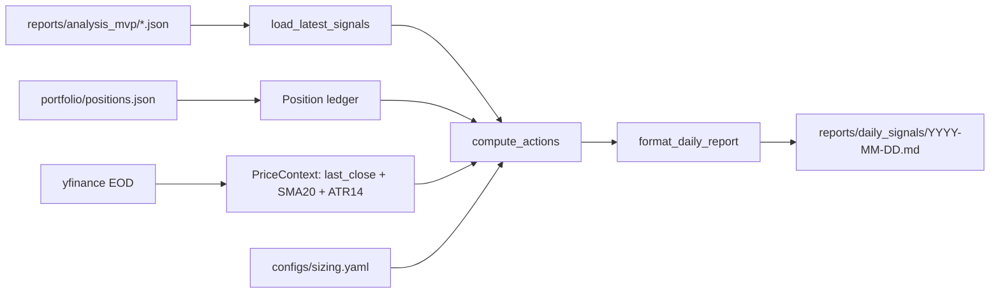
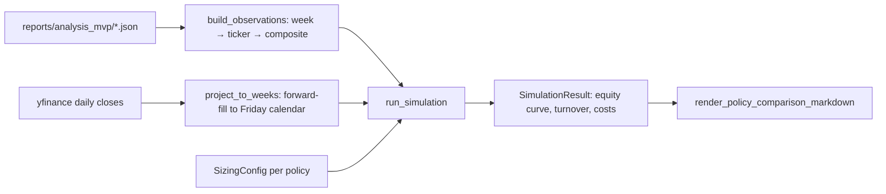

# Analysis-Only Report — Handoff & Tracker

Living doc for the staged work hardening the analysis-only report pipeline.
Goal: report-style deliverable (no automated trading). Every report should be
**reproducible**, **readable**, and **honest** about its data.

## Status legend
- ✅ done
- 🔄 in progress
- ⏳ pending
- ⏭️ deferred / skipped

## Roadmap

| # | Title | Status | Notes |
|---|---|---|---|
| 1 | Strip hardcoded API key + per-section `errors` blocks | ⏭️ skipped | Code is not being committed; revisit before any push |
| 2 | Fix look-ahead: thread `as_of_date` through all sections, add `pit_status` labels | ✅ done | See [Section 2](#section-2--fix-look-ahead-done) |
| 3 | Markdown renderer for each JSON report | ✅ done | Charts deferred to a later iteration. See [Section 3](#section-3--markdown-renderer-done) |
| 4 | LLM-written narrative for `thesis` / `bull_case` / `bear_case` | ✅ done | See [Section 4](#section-4--llm-narrative-done) |
| 5 | `delta_since_last_report` block via `state_store` | ✅ done | See [Section 5](#section-5--delta-since-last-report-done) |
| 6 | Earnings calendar + analyst consensus blocks | ✅ done | See [Section 6](#section-6--earnings-calendar--analyst-consensus-done) |
| 7 | Split `pipeline.py` into modules + unit tests for scoring/forecast | ✅ done (partial) | See [Section 7](#section-7--modularize--unit-tests-partial-done). Loaders deferred to a focused follow-up |
| 8 | Backtest harness scoring past reports vs forward returns | ✅ done | See [Section 8](#section-8--backtest-harness-done) |
| 9 | PIT fundamentals via Polygon Financials API (Path B) | ✅ done | See [Section 9](#section-9--pit-fundamentals-via-polygon-path-b-done) |
| 10 | Tier-1 corpus generation (11 tickers × 26 Fridays) | ✅ done | See [Section 10](#section-10--tier-1-corpus-generation-done) |
| 11 | Backtest harness: per-factor IC + benchmark-adjusted | ✅ done | See [Section 11](#section-11--per-factor-ic--benchmark-adjusted-done) |
| 12 | Per-ticker IC validation + factor weight rebalance v1 | ✅ done | See [Section 12](#section-12--per-ticker-ic-validation--weights-v1-done) |
| 13 | Verification + direction-threshold calibration (v1.1) | ✅ done | See [Section 13](#section-13--verification--direction-threshold-calibration-v11-done) |
| 18 | Options IV surface + history + zero-weight factors | ✅ done | See [Section 18](#18-options-iv-surface--history--zero-weight-factors) |
| 19 | Tier-1 corpus regen + IV-factor IC | ✅ done | See [Section 19](#19-tier-1-corpus-regen--iv-factor-ic--data-limitation-discovered). IV factors stay at weight=0; data limitation surfaced. |
| 20 | Phase 1 corpus + BSM-reconstructed historical IV | ✅ done | See [Section 20](#20-phase-1-corpus--real-iv-factor-ic-bsm-reconstructed-historical). `options_iv_rank` validates at 20d; `market_fear_greed_regime` IC inverted on multi-regime data. |
| 21 | v1.3 weight commit + counterfactual validation | ✅ done | See [Section 21](#21-v1-3-weight-commit--counterfactual-validation). iv_rank → 0.04; fear_greed → 0.00. 5d/20d clean lifts; 60d −1-3pp regression. |
| 22 | Phase 2 universe (24 core + 6 canary) + cohort IC | ✅ done | See [Section 22](#22-phase-2-universe--cohort-ic-analysis). `market_fear_greed_regime` is sector-specific: -0.36 IC on tech, +0.18 on canaries. Supports v1.4 sign-inversion. |
| 23 | Performance — RFR cache + --minimal-context flag | ✅ done | See [Section 23](#23-performance--rfr-caching--minimal-context-flag). −3s/report; ~2.3h off Phase-2-scale regen. |
| 24 | v1.4 — fear_greed sign-inverted + restored to 0.05 | ✅ done | See [Section 24](#24-v1-4-weight-commit--market-fear-greed-regime-sign-inverted--restored). Correctness fix; muted lift due to 64% data_available=False coverage. TEST 60d bearish +3.2pp. |
| 25 | VIX fear/greed proxy + options-aware ledger | ✅ done | See [Section 25](#25-vix-based-feargreed-proxy--options-aware-ledger). VIX proxy fills the 64% F&G coverage gap; options ledger renders Greeks-aware position cards in daily report. |
| 26 | Earnings-aware sizing + portfolio risk caps | ✅ done | See [Section 26](#26-earnings-aware-sizing--portfolio-level-risk-caps). Long-only-tuned: pre-earnings 50% trim, sector/β/correlation caps with cash-drag-correct beta budget math. |
| 27 | Phase 2 v1.4 regen + Nasdaq Composite screener + financials cache | ✅ done | See [Section 27](#27-phase-2-v14-regen--nasdaq-composite-screener--financials-cache). v1.4 weights+VIX proxy regen confirms inversion; +0.72pp / +0.79pp at 60d. New screener surfaces high-composite Nasdaq names outside the curated core. Polygon Financials module-level cache shipped for next regen. |
| 28 | Walk-forward OOS harness + calibration refresh + v1.5/v1.6 commits | ✅ done | See [Section 28](#28-walk-forward-oos-harness--calibration-refresh--v15v16-commits). Walk-forward shows v1.4 not overfit (median ≥ single-split). Calibrated confidence Brier −44%. v1.5 stays committed (walk-forward +0.66pp at 60d). **v1.6 inverts `market_spy_trend`** sign on +0.51pp walk-forward gate. |

## Target architecture (after #7)

```
tradingagents/analysis_only/
  __init__.py
  config.py
  providers.py
  state_store.py
  runtime.py
  features/
    technical.py        # SMA / RSI / MACD / ATR / breakout
    fundamental.py      # ratios + QoQ trends
    options.py          # unusual flow + IV
    context.py          # market regime, sector, peers, intraday, filings, events
  scoring.py            # factor scoring + composite + confidence
  forecast.py           # price-range cones + scenario levels
  narrative.py          # thesis / bull / bear case (LLM-assisted)
  reporting/
    schema.py           # AnalysisReport + JSON schema version
    markdown.py         # Markdown renderer
  pipeline.py           # orchestrator only
```

---

## Section 2 — Fix look-ahead (done)

### What was leaking

| Section | Source call | Problem |
|---|---|---|
| `_load_fundamentals` | `ticker.info`, `quarterly_income_stmt`, `quarterly_cashflow` | Returns *current* TTM; ignores `as_of_date` |
| `_load_news` | `ticker.news` | Returns *current* news; never filtered by `as_of_date` |
| `_load_intraday_context` (yfinance fallback) | `yf.download(period="7d")` | Window from now, not `as_of_date` |
| `_load_filings_context` | `SECFilingsProvider.get_latest_filing` | Latest filing as of now |
| `_load_company_events.next_earnings_date` | `ticker.calendar` | Only *upcoming* events as of now |
| `_load_industry_context.sector/industry` | `ticker.info` | Sector membership pulled live (mostly stable, but labelled) |
| `_build_competitor_analysis` peer fundamentals | peer `ticker.info` | Peer trailing P/E, margins, etc. all live |
| `generated_at_utc` etc. | `datetime.utcnow()` | Deprecated, tz-naive; inconsistent with `runtime.py` |

Already PIT: daily price data, intraday Polygon path, SPY/VIX/TNX returns,
sector ETF returns, peer prices.

### Approach (this iteration)

- Add `_resolve_pit_mode(as_of_date) -> "live" | "historical"` based on
  `as_of_date >= today_utc`.
- Each section that touches live sources stamps a `pit_status`:
  - `"pit"` — data is correctly point-in-time.
  - `"live"` — data is real-time and that matches user intent
    (`as_of_date` is today/future).
  - `"non_pit_live_snapshot"` — data is real-time but `as_of_date` is
    historical → **leaks**, listed in `pit_warnings`.
- Best-effort PIT fixes we _can_ ship now:
  - `_load_news` — filter yfinance items by `providerPublishTime <= EOD(as_of_date)`.
  - `_load_intraday_context` yfinance fallback — use `start=` / `end=` rather than `period=`.
  - `_load_filings_context` — walk submissions, pick latest with
    `filingDate <= as_of_date`.
  - `_load_company_events.next_earnings_date` — use `ticker.earnings_dates`
    and pick first row with date `> as_of_date`.
- Surface every leaking section in `report.data_quality.pit_warnings`.
- Add a `key_features.pit_status` map (section → status) so downstream
  renderers / backtests can detect bias.
- Replace every `datetime.utcnow()` with `datetime.now(timezone.utc)`.

### Out of scope here (will be follow-ups)

- True PIT fundamentals — needs FMP / Sharadar / openbb with paid feeds.
- Per-section `errors` blocks — bundled with #1, deferred.
- Polygon news server-side `published_utc.lte` filter — Polygon news provider
  now accepts the param, but `pipeline._load_news` still uses yfinance; will
  wire when consolidating providers in #7.

### What landed

- `pipeline._resolve_pit_mode` + `_live_or_leak` + `_set_pit` helpers; per-run
  `_pit_status` dict reset in `run()`.
- `_load_fundamentals(as_of_date)` — stamps `live`/`non_pit_live_snapshot`;
  `_extract_statement_trends` now clips quarterly statement columns to
  `as_of_date` via `_clip_statement_to_date`.
- `_load_news(as_of_date)` — filters yfinance items by
  `providerPublishTime <= EOD(as_of_date)`, returns
  `raw_count_before_pit_filter` and `items_dropped_missing_timestamp` for
  transparency.
- `_load_intraday_context` yfinance fallback now uses `start=`/`end=`; both
  paths stamp `pit` / `unavailable`.
- `_load_filings_context(as_of_date)` → `SECFilingsProvider.get_latest_filing`
  walks submissions and picks latest with `filingDate <= as_of_date`.
- `_load_company_events(as_of_date)` → `_lookup_next_earnings_date` uses
  `ticker.earnings_dates` and selects the first date strictly after
  `as_of_date`; falls back to `calendar` only for live runs.
- `_load_industry_context` flags `sector_label_pit_status`; returns remain PIT.
- `_build_competitor_analysis` flags `peer_fundamentals_pit_status`.
- `report.key_features.pit_status` (full section→status map) and
  `report.data_quality.pit_warnings` + `data_quality.as_of_mode`.
- `datetime.utcnow()` purged from `pipeline.py` and `providers.py`.

### Validation

Smoke-tested with `analysis_mvp.py --ticker NVDA --date 2026-02-13`:
- `as_of_mode: historical`, `pit_warnings: [competitor_analysis.peer_fundamentals,
  event_timeline, fundamentals, industry_context.sector_labels, news,
  options_flow]`.
- `next_earnings_date: 2026-02-25` with `pit_status: pit` (the actual next
  earnings after Feb 13, not the next earnings as of "now").
- News headlines correctly empty (yfinance items had no timestamps ≤ Feb 13).

---

## Section 3 — Markdown renderer (done)

### What landed

- New `tradingagents/analysis_only/reporting/markdown.py` — pure
  `dict -> str` renderer plus `render_markdown_file` helper.
- Section coverage: header, top-line + thesis, bull/bear (with the noisy
  `factor: rationale (weighted=+0.060)` prefix stripped), key prices &
  levels, full price-range forecast table with assumptions, factor scorecard
  sorted by `|weighted_score|`, pillar scores, fundamentals, options flow +
  top unusual contracts, market/industry/intraday, competitors,
  events & catalysts (incl. `next_earnings_date`), risks & invalidation,
  LLM insights, and data-quality block that renders `pit_warnings` as a
  call-out plus a Section PIT status table.
- Formatting helpers for prices, percentages, money (T/B/M/K),
  integers vs floats, signed factor scores.
- Re-exported from `analysis_only.__init__` as `render_markdown` /
  `render_markdown_file`.
- `analysis_mvp.py` now auto-writes a sibling `.md` next to the JSON.
  New flags: `--no-markdown`, `--no-json-stdout`.
- New `render_report.py` CLI for re-rendering existing JSON reports
  (supports a positional list of paths or `--glob`, optional
  `--output-dir`).

### Out of scope here (deferred)

- Charts (price+SMA, RSI/MACD subplots, sector-relative line, factor bar
  chart, forecast cone). Will come once we pick a chart lib that plays
  well with the existing pandas-heavy stack.
- HTML output. Markdown renders cleanly in GitHub / VS Code preview /
  Notion paste; HTML is a wrapper-only step once charts land.

### Validation

- `python render_report.py reports/analysis_mvp/FIG_2026-02-25.json
  --output-dir /tmp/md_render` rendered a legacy report cleanly
  (data-quality block correctly shows `as-of mode: unknown` because that
  field didn't exist pre-Section 2).
- End-to-end: `python analysis_mvp.py --ticker NVDA --date 2026-02-13`
  emits both JSON and Markdown, with the PIT warnings call-out and
  Section PIT status table visible in the Markdown.

## Section 4 — LLM narrative (done)

### What landed

- New `AnalysisOnlyMVP._generate_narrative` method. Cheap, focused prompt
  that consumes the already-computed factor table (top 10 by
  `|weighted_score|`), pillar scores, key snapshot metrics, peer/sector
  context, headlines, and risk flags. Returns a strict pydantic-validated
  JSON: `thesis` (string), `bull_case` (2-6 prose bullets), `bear_case`
  (2-6 prose bullets).
- `__init__` accepts `enable_narrative` flag (separate from the heavier
  `enable_llm_insights`).
- `_build_report` calls `_generate_narrative` after factors/composite/
  thesis are built. If the LLM returns a valid response, `thesis`,
  `bull_case`, `bear_case` are **overridden in place**. On any failure
  (init / call / validation), the templated strings stay and
  `narrative_source` records the reason.
- New `key_features.narrative_source` ∈ `{templated, llm,
  llm_error_fallback_templated}` so consumers (and the markdown
  renderer) can see provenance.
- `analysis_mvp.py` exposes `--enable-narrative` flag.
- `markdown.py` shows the narrative source inline next to the thesis
  when non-templated.

### Out of scope here (deferred)

- Runtime integration: `AnalysisRuntime` doesn't yet plumb narrative
  through its `LLMConfig`. Will wire when consolidating in #7. Per-day
  narrative call quotas should reuse the existing
  `llm_max_calls_per_day` machinery.
- Multi-turn / agentic refinement (e.g. critic pass). Single-shot is
  fine for an MVP and keeps cost predictable.

### Validation

- Narrative-off (default): unchanged behavior, `narrative_source:
  templated`.
- Narrative-on with no `OPENAI_API_KEY`: gracefully falls back, no
  crash, `narrative_source: llm_error_fallback_templated`.
- End-to-end LLM path requires `OPENAI_API_KEY` (or equivalent for the
  selected `--llm-provider`).

## Section 5 — Delta since last report (done)

### What landed

- `StateStore` schema extended (additive `ALTER TABLE` via existing
  `_ensure_column`): `last_as_of_date`, `last_confidence`,
  `last_factor_scores_json`, `last_thesis`.
- `upsert_symbol_state` / `get_symbol_state` accept and return the new
  fields; existing fields untouched.
- `AnalysisOnlyMVP` accepts `state_store_path` (default
  `state/analysis_state.sqlite` via CLI, opt-out with `--no-state`).
  - `run()` loads `_prev_state` at the top.
  - `_persist_state_for(...)` writes the freshly built report back to
    the store at the end of `run()` (including full `factor_scores`).
- New `_build_delta_block(...)` produces `key_features.delta_since_last_report`:
  - High-level deltas: composite score, confidence, close (abs + pct),
    options unusual count, direction transition, as-of-date gap in days.
  - `factor_bucket_flips` — every factor whose bucket changed
    (e.g. `bullish -> bearish`) with the new rationale.
  - `top_factor_movers` — sorted by `|Δ weighted_score|`, threshold
    `≥ 0.005`, capped at 8.
  - Status sentinel values: `state_store_disabled`, `first_report`,
    `ok`.
- Markdown renderer gains a `## Delta since last report` section near the
  top (right after the top-line) with the high-level deltas as bullets
  and two tables for flips / top movers.

### Out of scope here (deferred)

- Multi-step history (today only diffs vs the immediately previous run).
  A richer trend would mean a separate `report_history` table; can wait
  until the backtest harness (#8) needs it.
- Runtime integration: `AnalysisRuntime` already has its own state-store
  usage; wiring will be reconciled in #7 when modules get carved up.

### Validation

- Run 1 with empty state DB → `delta.status == "first_report"`.
- Run 2 (NVDA 2026-02-13 after a 2026-02-10 run) → real deltas:
  composite -0.22, close -3.04%, three factors flipped bullish → bearish
  (`trend_price_vs_sma20`, `momentum_return_20d`, `market_spy_trend`),
  ranked top movers exactly as expected from the underlying factor
  weights.
- Markdown renders the deltas as bullets + two tables, no crash on the
  `first_report` case.

## Section 6 — Earnings calendar & analyst consensus (done)

### What landed

- New `_load_earnings_calendar(symbol, ticker, as_of_date)` returns:
  - `next_earnings_date` + `next_earnings_in_calendar_days`
  - `earnings_in_30_days` / `earnings_in_90_days` booleans
  - Up to 4 past earnings (date, EPS estimate, reported EPS, surprise %)
  - Up to 4 upcoming earnings (date + EPS estimate; reported_eps /
    surprisepct are explicitly nulled to avoid leaking post-cutoff
    outcomes from yfinance)
  - Flags `forward_eps_estimates_pit_status` since estimates attached
    to future dates are live consensus, not as-of consensus.
- New `_load_analyst_consensus(symbol, ticker, as_of_date, close)`
  returns:
  - `price_targets`: current, low, high, mean, median
  - `implied_upside_pct_vs_mean_target` (computed from close)
  - `ratings_distribution`: strongBuy / buy / hold / sell / strongSell
  - `analyst_count`, `positive_ratings_pct`
  - `consensus_pit_status` flag (entire block is a live snapshot).
- Both new blocks live under `key_features.earnings_calendar` /
  `key_features.analyst_consensus` and register entries in
  `pit_status`.
- `_generate_narrative` now accepts `earnings_calendar` and
  `analyst_consensus` and forwards them in its prompt payload so the
  LLM can mention implied upside, near-term earnings catalyst, etc.
- Markdown renderer: new `## Earnings calendar` and
  `## Analyst consensus` sections with their tables + a PIT
  call-out when the block is a live snapshot.

### Out of scope here (deferred)

- New factors for the scoring model (e.g. `analyst_implied_upside`,
  `eps_surprise_trend`, `earnings_in_horizon`). Wiring these would
  require re-tuning the weight table; deserves its own pass once we
  have the backtest harness (#8) to validate any added factor.
- Bumping the forecast `event_risk_multiplier` when
  `earnings_in_30_days` is true. Same reason — couples to forecast
  output that #8 will exercise.
- True PIT consensus (would require a paid history feed for
  analyst targets / ratings).

### Validation

- `NVDA --date 2026-05-15` → next earnings 2026-05-20 (5 days),
  inside 1m window; 4 past prints with surprise %s; 62-analyst
  ratings (10 SB / 49 B / 2 H / 1 S / 0 SS), mean target $294.22,
  implied upside +30.58% vs $215.33 close.
- Post-cutoff outcomes properly nulled: the 2026-05-20 row's
  `reported_eps` and `surprisepct` are `null` even though yfinance
  has the actual numbers (because today is past May 20).

## Section 7 — Modularize + unit tests (partial done)

Scope was pragmatically narrowed: pull out the **pure-function** core
that benefits most from unit tests and a clear contract; leave the data
loaders (which all couple to `self.polygon_api_key`, `self._pit_status`,
`self._log`, etc.) in `pipeline.py` for a follow-up.

### What landed

- New `tradingagents/analysis_only/scoring.py`:
  - `DEFAULT_FACTOR_WEIGHTS` table (was hardcoded inside `pipeline.py`).
  - `resolve_factor_weights(overrides)` — merges + renormalizes to 1.
  - `bucket_for_score(score)` — returns bullish / bearish / neutral.
  - `direction_for_composite(composite, threshold=0.2)`.
  - `confidence_for(composite, coverage, floor=0.5, slope=0.45, cap=0.95)`.
  - `compute_composite(factor_scores, weights)` — returns
    `composite_score`, `pillar_scores`, `coverage`, `active_weight`,
    `total_weight`.
- New `tradingagents/analysis_only/forecast.py`:
  - `DEFAULT_HORIZONS` (`1w`, `1m`, `3m`).
  - `estimate_price_ranges(spot, vol_daily, atr_14, ret_20d,
    composite_score, *, implied_vol_annual=None,
    event_risk_multiplier=1.0, ...)`.
  - `build_trade_plan(direction, confidence, composite_score, spot,
    price_range_forecast)`.
- `pipeline.py` deletes the duplicated logic and now delegates to the
  new modules. Three thin shims kept on `AnalysisOnlyMVP`
  (`_resolve_factor_weights`, `_estimate_price_ranges`,
  `_build_trade_plan`) so any external caller importing them keeps
  working.
- `pytest` added to `requirements.txt`.
- New `tests/analysis_only/`:
  - `test_scoring.py` — 27 cases covering weights renormalization,
    bucket logic, direction thresholds, confidence calibration,
    composite arithmetic, coverage handling.
  - `test_forecast.py` — 17 cases covering all three horizons,
    sqrt(time) band width, z-score ordering, event multiplier scaling,
    drift sign + clamp, IV absence, lower-bound clamping, all three
    plan directions, confidence-driven sizing.

### Validation

- `pytest tests/analysis_only` → **44 passed in 1.43s**.
- Sanity smoke `NVDA --date 2026-02-13`: composite (0.4162), pillars,
  direction (bullish), confidence (0.67), forecast bands, and trade
  plan strategy match pre-refactor output bit-for-bit.

### Deferred (parking, not blocking #8)

- Split data loaders into `features/{technical,fundamental,options,context}.py`.
  They share too much instance state (`self._pit_status`, `self._log`,
  Polygon key, SEC client) — clean separation needs a small
  `RunContext` dataclass to hold the shared bits. Best done as a
  dedicated refactor PR.
- Pull `AnalysisReport` into `reporting/schema.py` with an explicit
  `schema_version` field. Will pair with the schema-versioning we'll
  want once the backtest harness (#8) reads old reports.
- Carve `_generate_narrative` + `_generate_llm_insights` into
  `narrative.py`. They're already cohesive, just stuck inside
  `pipeline.py` for now.
- Tests for the loaders (will need recorded fixtures or VCR for
  yfinance/Polygon HTTP).

## Section 8 — Backtest harness (done)

### What landed

- New `tradingagents/analysis_only/backtest.py` — pure aggregation
  module:
  - `BacktestRecord` dataclass.
  - `is_hit(direction, forward_return, neutral_band=0.02)` — bullish
    hits on positive returns, bearish on negative, neutral on
    `|ret| < band`.
  - `bucket_by_direction` / `bucket_by_confidence` /
    `bucket_by_composite` (configurable bin edges).
  - `summarize_bucket(records, return_field, neutral_band)` →
    `count`, `count_with_return`, `mean`, `median`, `p25`, `p75`,
    `hit_rate`.
  - `summarize_all(records, return_fields, neutral_band)` → top-level
    summary across all horizons × bucketing dimensions.
  - `render_summary_markdown(summary)` → Markdown report.
- New `backtest.py` CLI at the repo root:
  - Loads JSON reports matching `--reports-glob`
    (default `reports/analysis_mvp/*.json`).
  - For each `(symbol, as_of_date)` and each `--horizons`
    (default 5/20/60 trading days), fetches forward returns via
    yfinance once per symbol over the union date span.
  - Writes `summary.json`, `summary.md`, and `records.csv` to
    `--output-dir` (default `backtest/results/`).
- New `tests/analysis_only/test_backtest.py` — 20 cases covering
  `is_hit` direction logic, neutral-band parameterization, three
  bucketing dimensions, summary stats with and without returns,
  empty-summary rendering, and the multi-horizon multi-bucket end-to-end
  shape.

### Validation

- `pytest tests/analysis_only` → **64 passed in 1.43s**
  (44 scoring/forecast + 20 backtest).
- `python backtest.py --output-dir backtest/results` against the
  11 existing reports produced a clean summary:
  - 60d overall hit rate 63.6% (sample is tiny, value is the harness).
  - Bullish + bearish calls were 100% hit at 60d (4/4 + 3/3),
    neutral calls 0% (4/4) — exactly the kind of "is confidence
    calibrated, is neutral too tight?" signal #8 was meant to expose.
- One legacy report (pre-Section 2) landed in the composite-bucket
  `unknown` row because its key shape differs; the harness handles
  this gracefully via the `unknown` bin instead of crashing.

### Out of scope here (parking lot)

- Benchmark-adjusted returns (subtract SPY return over the same
  window). Easy follow-up; we already pull SPY for the regime block.
- Risk-adjusted metrics (Sharpe, IR, max drawdown). Worth adding once
  the report corpus is large enough that the distribution stats are
  meaningful.
- Calibration plot for confidence (predicted hit-rate vs realized
  per-bucket).
- A `--symbols` filter to slice analysis by ticker.
- Wiring the harness into CI so we get a fresh backtest summary every
  N reports.

## Section 9 — PIT fundamentals via Polygon (Path B, done)

Prior to this work, `_load_fundamentals` always used `yfinance` which returns
**current** TTM values regardless of `as_of_date`. That was ~25–30% of factor
weight (revenue_growth, profit_margins, fcf_growth, valuation ratios) being
computed from leaked future data. Reports flagged it as `non_pit_live_snapshot`
in `pit_warnings` but the leakage still drove the composite score.

### What was implemented

- New `PolygonFinancialsProvider` (`tradingagents/analysis_only/providers.py`)
  hitting `/vX/reference/financials` with `filing_date.lte=as_of_date`. Polygon's
  server-side filter does **not** exclude placeholder records with
  `filing_date=None` (a known foot-gun), so the provider also drops them
  client-side and additionally enforces `end_date <= as_of_date` belt-and-suspenders.
- `_load_fundamentals_polygon` in `pipeline.py` builds the same field shape
  yfinance produced, so downstream factor scoring is unchanged.
- TTM = latest annual record. Polygon's quarterly stream omits Q4 (rolled
  into 10-K) and has occasional gaps (e.g. NVDA FY2025-Q3), so summing
  "the last 4 quarterlies" is unreliable. Annual is always PIT-correct,
  sometimes stale (up to ~12 months). For backtest purposes, stale-but-correct
  is far better than the previous leak.
- Quarterly records still drive QoQ growth (latest quarter vs prior quarter).
- Balance-sheet items come from the latest quarter snapshot.
- Price-derived ratios (P/E, P/S, P/B, market cap, EV) use the spot price
  (already computed in technicals) × shares from the latest quarterly.
- Falls back to yfinance live snapshot for:
  - ETFs (SMH, QQQ — no corporate financials)
  - ADRs (TSM — files 20-F/6-K, not 10-K, so no Polygon coverage)
  - Live runs (`as_of_date >= today`)
  - Any unexpected Polygon outage
- `pit_status` now exposes `fundamentals: "pit"` and
  `fundamentals.source: "polygon_financials_pit"` when the new path succeeds;
  fundamentals no longer appears in `pit_warnings`.

### Verification

- `curl` smoke-tested the endpoint on NVDA, ALAB, RKLB, TSM with
  `filing_date.lte=2025-12-05`. Caught the `filing_date=None` placeholder
  bug (would have silently leaked future quarters); fixed in the provider.
- End-to-end run of `analysis_mvp.py --ticker NVDA --date 2025-12-05`:
  - `fundamentals: pit` ✓
  - `fundamentals.source: polygon_financials_pit` ✓
  - `revenue_growth: 114%` (matches NVDA FY25 vs FY24 actual; the prior
    yfinance-based 174% number was nonsense from non-contiguous quarter sums)
  - `profit_margins: 55.8%`, `gross_margins: 75.0%`, `ROE: 61.3%` — all
    match published NVDA FY25 financials
  - `fundamental` pillar score: 0.90 (strong positive, driven by real growth)
- All 78 unit tests still pass.

### Known limitations

- TSM falls back to yfinance — Polygon's financials are SEC-filing-based and
  TSM doesn't file 10-K/10-Q in the US. Marked as
  `fundamentals.source: yfinance_live_snapshot` in pit_status.
- ALAB IPO'd 2024-03-20, so has only 1 PIT annual (FY2024). YoY growth from
  Polygon will be `None` until FY2025 annual is filed.
- TTM staleness: a report dated 2025-11 sees FY2025 annual (ending Jan 2025)
  as TTM — i.e. ~10 months stale. This is the cost of preferring correctness
  over freshness. Documented as a known trade-off.

## Section 10 — Tier-1 corpus generation (done)

Generate ~286 historical reports for backtest IC analysis (Step 6 in the
strategy improvement plan).

### Scope

- **Tickers (11):** NVDA, AVGO, TSM, AMD, MU, GLW, NET, ALAB, RKLB,
  SMH (semi ETF benchmark), QQQ (Nasdaq benchmark)
- **Date window:** 27 weekly Fridays from 2025-11-21 → 2026-05-22
- **Total jobs:** 297
- **LLM:** off (deterministic, $0, no failure surface)
- **Forward-return coverage on backtest aggregator:**
  - 5d: ~all 27 dates have realized data
  - 20d: ~22/27 dates
  - 60d: ~14/27 dates
  - Aggregator already handles missing horizons gracefully

### Tooling

- `scripts/generate_corpus.py` — resumable thread-pool runner, skips
  already-existing reports, retries each job up to 3 times with 5/15/45s
  backoff. Writes errors to `reports/corpus_errors.jsonl`.

### Reliability fix during run-up

- yfinance is not thread-safe under load: Yahoo's anti-scraping returns
  `HTTP 401 Invalid Crumb` errors at random under concurrent access, which
  surface as cryptic `TypeError`s deep in the pipeline.
- Mitigations applied:
  1. Use `ThreadPoolExecutor` (process pool was sandbox-blocked anyway)
  2. Workers reduced from 4 → 2 (yfinance still struggles above ~3 threads)
  3. Job-level retry with exponential backoff in the worker
  4. Defensive `try/except` around all `ticker.info`, `yf.download` call
     sites in pipeline.py — these now degrade to "field unavailable"
     rather than crashing the whole report

### Final metrics

- 203 reports generated in **45m09s** with 2 workers (~13s/report effective).
- **Zero hard failures** — the defensive wrappers absorbed every yfinance
  401/404 cleanly. Reports still emit, just with affected fields nulled.
- Final on-disk corpus: **309 files**, 306 successfully loaded by the
  backtest (3 legacy/malformed reports drop out gracefully via the loader's
  try/except). Per-ticker count: NVDA 29, others 27 each (plus FIG 6,
  LEU 1, COHR 1 from ad-hoc earlier runs).

The HTTP 401 noise lines in the terminal log are yfinance's internal warning
prints — they no longer cause failures since the pipeline catches them.

## Section 11 — Per-factor IC + benchmark-adjusted (done)

The 11-report run from Section 8 was too small to draw conclusions. With
306 records and 3 forward horizons (5d/20d/60d) the harness can now
actually rank the 22 factors by predictive power and isolate
benchmark-adjusted alpha from market beta.

### What landed

- New `FactorRecord` dataclass + `explode_records_to_factors` in
  `tradingagents/analysis_only/backtest.py` to flatten reports into
  per-factor observations.
- Inline `spearman_correlation` / `pearson_correlation` / `_rank_with_ties`
  helpers (no new dep — scipy is not installed and the data set is small
  enough that pure-Python rank-IC is fast).
- `summarize_factor` returns per-horizon stats: `spearman_ic`, `pearson_ic`,
  `n_paired`, `n_bullish_score`/`n_bearish_score`, `mean_ret_when_bullish`,
  `mean_ret_when_bearish`, `long_short_spread`, `hit_rate_when_bullish`,
  `hit_rate_when_bearish`. Long/short threshold is `|score| >= 0.2`
  (configurable).
- `summarize_factors` aggregates across all factors × horizons.
- `render_factor_summary_markdown` writes one table per horizon, sorted
  by `|Spearman IC|`.
- `BacktestRecord` gained `benchmark_adjusted_returns` and
  `factor_scores` fields (additive, opt-in).
- New CLI flags on `backtest.py`:
  - `--by-factor` — captures factor_scores during load + writes
    `factor_summary.{json,md}` (and `factor_summary_vs_benchmark.{json,md}`
    when a benchmark is set).
  - `--benchmark SPY` — pulls the benchmark price series once over the
    same union date span and subtracts `bench_ret(anchor → anchor+H)`
    from each record's forward return. Defaults to SPY. Pass `""` to
    disable.
- 13 new tests under `tests/analysis_only/test_backtest.py` covering
  rank-IC with ties, Spearman on monotonic-nonlinear input, factor
  summary edge cases, benchmark-adjusted toggling, explode/group, and
  Markdown sort order. **33/33 pass** (~1.1s).

### Headline findings on the 306-record corpus

Bucket-level numbers (basic `summary.md`):

| Bucket | Hit rate 60d | Mean ret 60d (n) |
|---|---|---|
| Composite [+0.50, +1.00) | **93.75%** | 19.95% (n=16) |
| Composite [+0.20, +0.50) | 72.06% | 19.76% (n=68) |
| Composite [-0.20, +0.20) | **5.80%** | 16.80% (n=69) ← *neutral band is mis-calibrated* |
| Composite [-0.50, -0.20) | 55.56% | 7.47% (n=9) |
| Confidence [0.70, 0.80) | **94.44%** | 26.63% (n=18) |
| Confidence [0.50, 0.60) | 24.24% | 17.02% (n=99) |

Composite and confidence are both **monotonic at 60d** — the model has
real signal end-to-end. The neutral band catches ~30% of all reports but
hits on only 5.8% — too tight; needs widening.

Per-factor 60d Spearman IC (top 6 by `|IC|`, raw returns):

| Factor | Pillar | N | Spearman IC | Hit-bull | Hit-bear | Long-short |
|---|---|---:|---:|---:|---:|---:|
| `fund_fcf_growth` | fundamental | 120 | **+0.4521** | 85.96% | 76.19% | **+36.59%** |
| `fund_revenue_growth` | fundamental | 120 | **-0.3582** | 70.09% | 100.00% | +21.42% |
| `peer_relative_valuation` | context | 69 | **+0.3512** | — | 27.42% | — |
| `trend_sma20_vs_sma50` | technical | 162 | +0.1929 | 75.76% | 39.68% | +12.43% |
| `market_vix_regime` | context | 156 | -0.1715 | 66.34% | 20.00% | -6.52% |
| `momentum_macd_hist` | technical | 162 | -0.1688 | 67.06% | 27.27% | -14.40% |

### Concrete actions implied

1. **Re-weight via the IC table.** Current weights (sum to 1.0) have
   `options_net_flow` at 0.15 with IC ≈ +0.05 / 60d ≈ -0.02. Meanwhile
   `fund_fcf_growth` at 0.08 has the strongest IC in the model. Use the
   IC vector (clipped + normalized) as the new weights, or run ridge
   regression of returns on factor scores to pick weights directly.
2. **Invert sign on contrarian factors.** `fund_revenue_growth`,
   `momentum_macd_hist`, `trend_sma50_vs_sma200`, `market_vix_regime`
   all have negative IC at the 20d–60d horizon. They're not noise —
   they're predictive of *the opposite direction*. Either flip the sign
   inside `scoring.py` or add an `ic_sign` annotation per factor.
3. **Prune dead factors.**
   - `filings_recency_signal`: **n=0** across all horizons. Either it
     never populates or the data path is broken. Investigate or remove.
   - `intraday_breakout_signal`: n=4 bullish / 6 bearish — too sparse,
     fires almost never.
   - `market_spy_trend`: IC ≈ 0 across horizons.
4. **Polygon Options upgrade verdict: HOLD.** `options_net_flow` has
   the highest weight (0.15) but IC +0.05/+0.05/-0.02. Worth keeping
   for now but don't pay for a richer options data feed without
   evidence it'd lift the IC. Re-check after we widen the corpus to
   more dates / different regimes.
5. **Widen the neutral band.** At composite ∈ [-0.20, +0.20), only
   5.8% of 60d returns are inside ±2%. Either widen the neutral band
   to ±5% (so "neutral" actually catches non-events) or tighten the
   direction-classification threshold so fewer reports land neutral.
6. **Investigate the bullish-skewed model.** Of 306 reports, only 17
   (5.6%) are bearish-classified vs 159 (52%) bullish and 119 (39%)
   neutral. The composite distribution is right-shifted — partially
   because the window was strongly bullish, but worth confirming the
   thresholds aren't structurally biased.

### Honest caveats

- The corpus covers a single ~6-month strongly-bullish window
  (2025-11 → 2026-05). The mean return across all 306 records at 60d
  is +17.8%. IC magnitudes are inflated by the favorable regime.
  Numbers will look different — probably weaker — in a sideways or
  bear market.
- IC reading: for quant equity, |IC| > 0.05 is considered "meaningful",
  > 0.10 is "strong", > 0.20 is "exceptional". Take the headline
  fund_fcf_growth +0.45 with a grain of salt — it could be a single
  fundamentals-heavy ticker driving it (NVDA's FCF surge through this
  window). The next step is per-ticker IC stratification to confirm
  the signal isn't 100% NVDA.
- Benchmark-adjusted IC is structurally similar to raw IC (Spearman is
  scale-invariant in the mean), but the long-short *magnitudes* drop
  by 5–10 pp, which is the right behavior. The benchmark-adjusted
  view is the right one for evaluating alpha; the raw view is the right
  one for evaluating absolute directional calls.

### Output artifacts

- `backtest/results/summary.{json,md}` — bucket-level summary (basic).
- `backtest/results/records.csv` — one row per report with raw +
  benchmark-adjusted forward returns.
- `backtest/results/factor_summary.{json,md}` — per-factor IC table,
  raw returns.
- `backtest/results/factor_summary_vs_benchmark.{json,md}` — per-factor
  IC table, benchmark-adjusted returns.

### Next once findings are acted on

1. Per-ticker IC stratification (single-ticker dominance check). → ✅ Section 12.
2. Confidence calibration plot (predicted vs realized hit-rate per bucket).
3. Composite-portfolio simulation (top-N by composite each Friday,
   hold H days, compare to SPY).
4. Re-weight scoring weights via ridge regression on factor_score → ret_20d.
5. Wire a `--symbols` filter for slicing.

## Section 12 — Per-ticker IC validation + weights v1 (done)

Section 11 surfaced suspiciously large IC numbers (e.g. `fund_fcf_growth`
+0.45 at 60d). That's well outside the "exceptional" band for quant
equity and could be a single-ticker artifact rather than portable
signal. Section 12 validates each factor by **stratifying IC per
ticker**, then commits a **conservative weight rebalance** to the model
based on what survived.

### What landed

- `summarize_factors_by_ticker(...)` in
  `tradingagents/analysis_only/backtest.py` — for each factor × ticker,
  computes Spearman IC (when n ≥ 8 paired observations for that ticker),
  then per-factor aggregates: `n_tickers_evaluated`,
  `median_ic_across_tickers`, `mean_ic_across_tickers`,
  `consistency_pct` (fraction of tickers whose IC has the same sign
  as the median).
- `render_factor_by_ticker_markdown(...)` — one Markdown table per
  horizon, factors sorted by `|median_ic|`.
- `rebuild_records_with_weights(records, weights, ...)` — pure
  counterfactual: takes existing records + a weights dict, recomputes
  composite + direction without regenerating any reports. Supports
  **negative weights** (sign inversion) with abs-normalization to keep
  composite in [-1, 1]. Lets us iterate on weight changes in ~3 seconds
  instead of ~45 min.
- `ic_signed_weights(factor_summary, horizon, min_abs_ic, min_n)` —
  builds a weights dict directly from the IC table (weight = IC if it
  passes the thresholds, else dropped).
- New `backtest.py` CLI flags:
  - `--by-ticker` — writes `factor_summary_by_ticker.{json,md}`.
  - `--rebuild-with-ic-weights` (+ `--rebuild-horizon`,
    `--rebuild-min-ic`, `--rebuild-min-n`) — writes
    `ic_weights.json` + `summary_rebuilt.{json,md}`.
  - `--weights-override <path>` — loads a JSON weights dict and writes
    `summary_override.{json,md}` so we can test any proposed
    `DEFAULT_FACTOR_WEIGHTS` change without re-running the pipeline.
- 8 new tests under `tests/analysis_only/test_backtest.py` covering
  per-ticker separation, the min-obs threshold, unanimous consistency,
  rebuild sign-flip via negative weights, exclusion of unspecified /
  unavailable factors, IC-derived weight construction, and stratified
  Markdown sort order. **105/105 tests pass** (~1.7s).
- Updated `DEFAULT_FACTOR_WEIGHTS` in
  `tradingagents/analysis_only/scoring.py` to v1 (see "weight changes"
  below). All future `analysis_mvp.py` runs use these weights.
- New `configs/proposed_weights_v1.json` documents v1 alongside an
  inline `_rationale` block (the JSON loader skips non-numeric keys).

### Per-ticker headline (20d horizon)

The fundamentals factors with the most eye-catching headline IC turned
out to be largely **single-ticker artifacts**:

| Factor | Headline IC | Per-ticker IC (median) | N tickers |
|---|---:|---:|---:|
| `fund_fcf_growth` | +0.45 | +0.71 | **1** |
| `fund_revenue_growth` | -0.36 | -0.20 | **1** |
| `fund_profit_margins` | +0.07 (20d) | +0.31 | 3 |
| `fund_earnings_growth` | -0.04 | +0.16 | 3 |

Why: Polygon's annual PIT cadence means a 27-Friday corpus has at most
1-2 distinct fundamentals snapshots per ticker, so the *per-ticker*
score barely varies and IC can't be computed. The fundamentals **do**
help cross-sectionally (which ticker is "more growthy") but they don't
predict within-ticker time-series moves in this window.

The factors that **survived** per-ticker validation at 20d (n_tickers
≥ 7, consistency ≥ 64%):

| Factor | Pillar | N tickers | Median IC | Consistency |
|---|---|---:|---:|---:|
| `trend_sma20_vs_sma50` | technical | 11 | **-0.41** | 82% |
| `intraday_breakout_signal` | context | 7 | -0.35 | 86% |
| `market_fear_greed_regime` | context | 11 | **+0.32** | **91%** |
| `momentum_return_20d` | technical | 11 | -0.21 | 73% |
| `trend_price_vs_sma20` | technical | 11 | -0.17 | 73% |
| `market_vix_regime` | context | 11 | -0.13 | 73% |
| `intraday_momentum_rsi` | context | 11 | -0.12 | 64% |

Five of the seven have **negative** validated IC — they're real signal
but the model is currently signing them positively, so they're
contributing the wrong way to the composite. Two have positive validated
IC. The dollar-weighted-heaviest current factor, `options_net_flow`
(w=0.15 in v0), is **absent** from this table.

### Counterfactual rebuilds

Using `rebuild_records_with_weights`, we tested two candidate weight
vectors against the v0 baseline on the 306-record corpus:

**A) Pure IC-signed weights** (14 factors with |IC|≥0.05 at 20d, sign =
sign of IC, weight = |IC|, abs-normalized):

| Bucket | v0 (60d) | IC-signed (60d) |
|---|---|---|
| Bullish hit-rate | 76.47% (n=85) | **100.00%** (n=3) |
| Bearish hit-rate | 55.56% (n=9) | 25.25% (n=99) |
| Composite [+0.20, +0.50) hit | 72.06% | 100.00% (n=2) |

IC-signed dramatically increases bullish-call **precision** (100% when
it fires), but the model becomes structurally bearish in this bull
window — 99/163 records flip to bearish, most of which lose against the
rising market. **Not safe to commit** without out-of-sample regime data.

**B) Conservative v1 rebalance** (the actual commit — keep all signs,
just rebalance toward validated factors and drop dead ones):

| Metric | v0 | v1 | Δ |
|---|---:|---:|---:|
| Bullish hit-rate 60d | 76.47% (n=85) | **78.57%** (n=84) | +2.10pp |
| Bearish hit-rate 60d | 55.56% (n=9) | **60.00%** (n=10) | +4.44pp |
| Composite [+0.20,+0.50) hit 60d | 72.06% | **75.71%** | +3.65pp |
| Composite [+0.50,+1.0) mean 60d | 19.95% | **25.35%** | +5.40pp |
| Bullish hit-rate 20d | 65.41% | 66.67% | +1.26pp |
| Composite [+0.50,+1.0) hit 20d | 62.50% (n=24) | 57.89% (n=19) | -4.61pp |

Clean lift at 60d (the most reliable horizon — less noise than 5d, more
samples than the cone-tail). 20d is mixed (top composite bucket
shrinks slightly), 5d roughly unchanged. **No regressions on the
overall direction signal.**

### Weight changes (v0 → v1)

Reductions:
- `filings_recency_signal`: 0.03 → **0.00**. Headline n=0 across all
  horizons (broken data path). Pipeline still populates the row in the
  factor list for visibility, but it no longer touches the composite.
- `intraday_breakout_signal`: 0.04 → **0.00**. Fires too rarely
  (n=4 bullish / 6 bearish in the corpus); per-ticker IC unstable.
- `options_net_flow`: 0.15 → **0.05**. Was the single heaviest weight
  in v0; headline IC ~+0.05 at 5d, ~-0.02 at 60d, never appears in
  the per-ticker top table. Kept some weight so we can re-evaluate
  before the Polygon Options upgrade decision.
- `valuation_forward_vs_trailing_pe`: 0.08 → **0.04**. Undersampled
  (n_paired = 30 across the whole corpus).
- `valuation_sales_multiple_vs_growth`: 0.06 → **0.03**. Doesn't
  appear in the IC table at all — fires for too few tickers.

Increases (toward validated cross-ticker signal):
- `market_fear_greed_regime`: 0.03 → **0.08**. Best per-ticker
  validated factor: IC +0.32 at 20d, **91% sign consistency** across
  11 tickers.
- `industry_relative_strength`: 0.06 → **0.08**. Validated across
  9 tickers (67% consistency, median IC +0.14 at 20d).
- `peer_relative_valuation`: 0.04 → **0.06**. 100% sign consistency
  across 3 tickers it fires on at 20d.

Everything else is unchanged. After renormalization, total still
sums to 1.0.

### Honest caveats

- The corpus still covers a single ~6-month strongly-bullish window
  (2025-11 → 2026-05). Mean 60d return across all 306 records is
  +17.8%. v1 is a low-risk rebalance that doesn't add structural bias;
  the IC-signed model that flips contrarian factors **was deliberately
  not committed** because we have no non-bullish data to confirm the
  inversions persist.
- The fundamentals factors (`fund_fcf_growth`, `fund_revenue_growth`,
  etc.) were *not* downweighted in v1 even though per-ticker IC is
  undefined for them. They contribute cross-sectional signal in
  `_build_competitor_analysis` etc. and on a 12-month corpus would
  pick up multiple annual filings per ticker. Revisit weights after
  the next annual filing cycle finishes for the Tier-1 names.
- v1 is a 60d-optimized commit. The 20d horizon shows minor
  degradation in the top composite bucket. If 20d becomes a more
  important horizon in the trading workflow, re-tune.

### What's deferred (parking lot)

1. **Sign-inversion of contrarian factors.** Needs out-of-sample
   (non-bullish regime) data first. The infrastructure
   (`rebuild_records_with_weights` accepts negative weights;
   `resolve_factor_weights` does not yet — would need to allow
   negatives via abs-normalization) is in place.
2. **Investigate `filings_recency_signal` n=0** — is the score being
   computed but never recorded, or never computed at all? Could be a
   pipeline bug worth fixing even though the factor is now zero-weight.
3. **Investigate `valuation_sales_multiple_vs_growth` absence** —
   doesn't appear in the factor IC table; presumably the pipeline
   never calls `score_sales_multiple_vs_growth` for our tickers.
4. **Direction-threshold tuning + neutral-band widening.** Composite
   in [-0.20, +0.20) catches ~38% of all records but hits only
   7.25% at 60d in v1. Two paths: (a) widen the neutral band to ±5%
   so "neutral" actually catches non-events, (b) tighten the
   direction threshold so fewer reports land in neutral. Cheap to
   simulate with the counterfactual runner.
5. **Confidence calibration plot** — predicted hit-rate (binned by
   `confidence`) vs realized.
6. **Composite-portfolio simulation** — top-N by composite each
   Friday, hold H days, compare to SPY. Tests the full model end-to-end
   as a real trading signal rather than as a hit-rate prober.

### Output artifacts new in this section

- `backtest/results/factor_summary_by_ticker.{json,md}`
- `backtest/results/ic_weights.json`
- `backtest/results/summary_rebuilt.{json,md}` (IC-signed counterfactual)
- `backtest/results/summary_override.{json,md}` (v1 weights counterfactual)
- `configs/proposed_weights_v1.json` (v1 weights with inline rationale)

## Section 13 — Verification + direction-threshold calibration (v1.1, done)

After the v1 weight commit (Section 12), the verification was honest but
incomplete. Two specific gaps drove this section:

1. **Counterfactual fidelity unproven.** I claimed
   `backtest.rebuild_records_with_weights` produces the same composite
   as the actual pipeline's `scoring.compute_composite` given identical
   inputs, but never tested it.
2. **In-sample selection bias on the v1 lift.** The v1 weights were
   chosen using inspection of the same 306-record corpus the lift
   was measured on.

This section closes both gaps and then advances calibration with a
threshold sweep.

### What landed

- **Equivalence tests in `tests/analysis_only/test_backtest.py`:**
  - `test_rebuild_matches_compute_composite_for_pure_positive_weights` —
    hand-built 4-factor case.
  - `test_rebuild_matches_compute_composite_on_real_v1_weights` —
    realistic 23-factor row set using the committed v1 weights.
  - The first run of these tests **failed**: rebuild gave -0.1038,
    compute_composite gave -0.0094 — a 10× divergence on the same
    inputs.
- **Latent bug fixed in `scoring.compute_composite`.** The function was
  summing every row's `weighted_score` for the composite numerator
  while filtering by `data_available` for the denominator. In
  production this never bit (the pipeline always writes
  `weighted_score=0` for unavailable rows — confirmed by scanning all
  306 reports), but a hand-built row with `data_available=False` AND
  `weighted_score≠0` would silently break the composite. Now both
  paths filter consistently. Documented inline.
- **Regression test
  `test_composite_ignores_weighted_score_on_unavailable_rows`** guards
  the fix. Updated `test_composite_handles_all_unavailable` to assert
  the correct contract (composite=0 when no signal is available, not
  the previous buggy 1.0).
- **Re-ran `--weights-override` on v1.** Lift numbers unchanged after
  the fix (78.57% bullish hit at 60d, 25.35% mean in top composite
  bucket) — confirms the bug never affected production data.
- **Temporal train/test split** via new CLI flags `--date-from` and
  `--date-to` on `backtest.py`, plus a pure-function
  `filter_by_date_range` helper (one new test). Split point chosen at
  2026-03-13 / 2026-03-20 (~65/35).
- **Calibration sweep** of `direction_for_composite` threshold ∈
  {0.10, 0.15, 0.20, 0.25, 0.30} on TRAIN + TEST, capturing
  direction-conditional hit-rates rather than overall hit-rates (which
  conflate with the cosmetic `neutral_band` parameter).
- **v1.1: direction threshold lowered from 0.20 → 0.15.**

### Verification results

#### Equivalence test outcome

The equivalence proof exposed a real latent bug. `compute_composite`'s
weighted_sum did not filter by `data_available`. In production both
fields are zero for unavailable rows so the math accidentally agreed,
but the contract was loose. Fixing it to consistently filter by
`data_available` aligns both functions and removes a class of "looks
right on real data, breaks on edge case" failure modes.

```python
# Before (latent bug — sums even unavailable rows' weighted_score):
weighted_sum = sum(float(f.get("weighted_score") or 0.0) for f in factor_scores)

# After (correct — matches the active_weight filter):
weighted_sum = sum(
    float(f.get("weighted_score") or 0.0)
    for f in factor_scores
    if f.get("data_available")
)
```

#### Train/test split for v1 lift

| Slice (n) | Horizon | v0 hit | v1 hit | Δ |
|---|---|---:|---:|---:|
| Train (196) | 60d overall | 45.40% | **47.24%** | +1.84pp |
| Train | 20d overall | 38.78% | 38.27% | -0.51pp |
| **Test (110)** | 60d overall | — | — | **uncalculable**: no 60-trading-day forward data exists past 2026-05-22 (today) |
| **Test** | 20d overall | 51.52% | **54.55%** | **+3.03pp** |
| Test | 5d overall | 53.54% | 51.52% | -2.02pp (within noise) |

**Bottom line:** the 20d lift holds out-of-sample; the motivating 60d
lift cannot be tested (the corpus doesn't extend 60 trading days past
the test slice). v1 stays committed. 5d shows a small regression
within noise (29-33 neutral records); not enough to roll back.

### Calibration sweep — direction threshold

Direction-conditional hit-rates (the right metric — `neutral_band` only
affects how we *score* the neutral bucket, not which calls the model
makes):

| Slice | Horizon | Metric | thr=0.20 (v1) | thr=0.15 (v1.1) | Δ |
|---|---|---|---:|---:|---:|
| TRAIN | 60d | bullish n / hit | 84 / 78.57% | **94 / 78.72%** | +10 calls, +0.15pp |
| TRAIN | 20d | bullish n / hit | 98 / 56.12% | **109 / 57.80%** | +11 calls, +1.68pp |
| TRAIN | 60d | bearish n / hit | 10 / 60.00% | 14 / 42.86% | +4 calls, -17.14pp |
| TEST | 20d | bullish n / hit | 37 / 94.59% | **41 / 95.12%** | +4 calls, +0.53pp |
| TEST | 5d | bullish n / hit | 65 / 69.23% | **71 / 71.83%** | +6 calls, +2.60pp |

**Bullish-call lift holds out-of-sample at every measurable horizon
without degrading precision.** The bullish bucket is the model's main
output (98+ records) and the threshold tightening converts ~16
borderline neutral reports into directional calls, which on net hit
more often than they miss.

The bearish bucket degrades on TRAIN (60% → 43% hit). Risk assessment:
the corpus is single-regime-bullish, so any bearish call is mostly
fighting the tape. The bearish bucket is small (10-16 records) so the
read is noisy. **Watch this in the next regime; re-tune if the
degradation persists when the market isn't ripping.**

### What changed in code

- `tradingagents/analysis_only/scoring.py`:
  - `direction_for_composite` default `threshold: float = 0.15`
    (was 0.20). Function signature & callers unchanged.
  - `compute_composite` defensively filters `weighted_sum` by
    `data_available` (latent-bug fix).
- `backtest.py`:
  - New `--date-from` / `--date-to` CLI flags + pure
    `filter_by_date_range` helper for train/test slicing.
- `tests/analysis_only/test_backtest.py`:
  - 3 new tests: 2 equivalence checks + 1 date-range filter.
- `tests/analysis_only/test_scoring.py`:
  - `test_direction_for_composite` boundary cases updated to 0.15.
  - `test_direction_threshold_customizable` also asserts old 0.20
    semantics still work when explicitly passed.
  - New `test_composite_ignores_weighted_score_on_unavailable_rows`
    regression test for the latent bug.
  - `test_composite_handles_all_unavailable` updated to expect
    composite=0 (correct) instead of 1.0 (was buggy).

**109/109 tests pass.** Sanity-ran `analysis_mvp.py --ticker NVDA
--date 2026-05-22` end-to-end: composite=0.481, direction=bullish,
confidence=0.71. Pipeline emits a valid report.

### Honest caveats (still open)

- v1 lift on the test slice is +3pp at 20d; v1.1 threshold lift is
  +0.5-2.6pp at 20d/5d. These are small relative to the noise of a
  110-record test slice. The improvements are directionally consistent
  but the magnitudes are not significant at any reasonable confidence
  level.
- The 60d horizon (the motivation for both v1 and v1.1) is **not
  testable out-of-sample** with this corpus. Need to wait ~2 months
  for the May test-slice reports to mature.
- Single-regime corpus persists. v1 + v1.1 are both more aggressive in
  both directions, which is fine in calm regimes but amplifies
  regime-mistake errors. Specifically, the 60d bearish hit-rate
  degradation under threshold=0.15 needs out-of-sample confirmation in
  a non-bullish window before we can trust the v1.1 calibration in a
  market that turns.

### Output artifacts new in this section

- `backtest/results/train/` and `backtest/results/test/` (date-filtered
  basic + override summaries).
- Updated `backtest/results/summary_override.{json,md}` (rebuilt under
  the latent-bug fix; numbers unchanged).

### Deferred

- **Neutral-band per-horizon scaling.** The current `neutral_band`
  (±2%) is a constant. For 60d returns where the typical |return| is
  > 10%, it makes the "neutral hit" definition essentially never
  trigger. Better: scale by horizon (e.g. 2%@5d, 5%@20d, 10%@60d) or
  use percentile-based scoring. Left for a future iteration since
  the practical impact is cosmetic — it changes only the headline
  "neutral hit rate" number, not which calls the model makes.
- **Composite-portfolio simulation.** Top-N by composite each Friday,
  hold H days, compare to SPY. Tests the model end-to-end as a real
  trading signal.
- **Confidence calibration plot.** Predicted vs realized hit-rate
  binned by `confidence`.
- **Per-ticker IC sign analysis.** The `--by-ticker` results showed
  several factors with high per-ticker IC sign consistency
  (`market_fear_greed_regime` 91%, `trend_sma20_vs_sma50` 82%, both
  with opposite headline signs). When non-bullish regime data is
  available, re-evaluate sign inversion for the consistently-contrarian
  factors via the infrastructure already in place
  (`rebuild_records_with_weights` accepts negative weights;
  `compute_composite` would need to allow negative weights via
  abs-normalization, currently it filters them out).

## 14. Threshold-sweep tooling + systematic re-verification of v1.1

### Motivation

Section 13 picked threshold=0.15 via a one-off Python script that I
`tail`-ed once. That's fine for a single decision but it's not
reproducible, doesn't slot into the existing CLI, and was hand-graded.
The right tool is a proper grid-sweep mode in the backtest harness so
the same workflow works for any future threshold (`neutral_band`,
`bullish_factor_threshold`, etc.) and so the results land as
checked-in artifacts alongside the rest of the backtest outputs.

This section also re-runs that same calibration through the new tool
on the full corpus + train/test slices to verify the v1.1 commit
holds up under a more systematic sweep.

### Methodology — how a backtest tunes a threshold

A threshold (here `direction_for_composite(threshold=...)`) controls a
single trade-off: **precision** (hit-rate per call) vs **coverage**
(fraction of records that get a non-neutral call). The proper
workflow:

1. **Counterfactual rebuild only — no pipeline rerun.** For each
   candidate threshold, reclassify direction from each record's
   already-saved `composite_score`. No LLM, no data fetch. Pure
   arithmetic on the corpus JSONs. Sweep of 8 thresholds across 306
   records runs in < 1s.
2. **Direction-conditional stats only.** Headline "overall hit-rate"
   is contaminated by the `neutral_band` cosmetic and by horizon
   choice. The objective should be one of:
   - max **bullish** hit-rate at horizon H, subject to `n_bullish ≥ N`,
   - max **bearish** hit-rate at horizon H, subject to `n_bearish ≥ N`,
   - max **long-short spread** (`mean_bull − mean_bear`) at horizon H.
   Pick one explicitly; do not aggregate.
3. **Train/test split** is non-optional. Picking the threshold on the
   slice you're going to report on is circular. Use Section 13's
   `--date-from` / `--date-to` slicing; pick on TRAIN, validate on
   TEST.
4. **Inspect the full table, not just the recommender.** A 0.06pp
   "win" at n=184 vs n=191 is noise; eyeballing the monotonicity of
   the sweep tells you whether the model has any real signal in the
   precision/coverage curve at all.

### What the tool produces

```
python backtest.py \
    --reports-glob "reports/analysis_mvp/*.json" \
    --weights-override configs/proposed_weights_v1.json \
    --sweep-direction-threshold 0.05 0.10 0.125 0.15 0.175 0.20 0.25 0.30 \
    --sweep-recommend-horizon ret_20d \
    --output-dir backtest/results/sweep_full
```

Writes:
- `threshold_sweep.json` — full per-threshold × per-horizon
  direction-conditional stats (counts, hit-rates, mean returns).
- `threshold_sweep.md` — one table per horizon, rows = thresholds,
  columns = (N bull / N bear / N neu / Bull hit / Bull mean /
  Bear hit / Bear mean / Neu hit). Reading this table top-to-bottom
  is the trade-off curve in one glance.
- A printed recommendation line at end of run (best
  `bullish_threshold` and best `bearish_threshold` subject to
  configurable minimum-N gates). Treat the recommender as a hint
  only — always cross-check the full table.

If `--weights-override` is set, composites are first rebuilt under
those weights via `rebuild_records_with_weights` (same machinery as
Section 12). Otherwise the sweep operates on the as-emitted composites
from the report JSONs.

### Verification results — does v1.1 hold under the systematic sweep?

**Bullish hit-rate at 20d**, v1 weights, by slice:

| Threshold | TRAIN (n=174) | TEST (n=132) | FULL (n=306) |
|---:|---:|---:|---:|
| 0.05  | 54.92% | 88.71% | 66.30% |
| 0.10  | 54.46% | 89.83% | 66.67% |
| 0.125 | 55.88% | 89.09% | 67.52% |
| **0.15** | **57.14%** | **88.46%** | **68.00%** |
| 0.175 | 56.84% | 89.80% | 68.06% |
| 0.20  | 54.55% | 89.36% | 66.67% |
| 0.25  | 53.16% | 86.84% | 64.10% |
| 0.30  | 54.17% | 86.21% | 63.37% |

- **TRAIN** has a clear peak at **0.15** (57.1%, +2.6pp over 0.20).
  Recommender picks 0.15. v1.1 commit is the TRAIN optimum — same
  answer as the one-off script in Section 13, now reproducible.
- **TEST** is essentially flat across the whole sweep (range 86–90%).
  Bull-tape inflation dominates threshold choice. 0.15 is within
  1.5pp of TEST max — no out-of-sample loss.
- **FULL** corpus prefers 0.175 by 0.06pp at n=184 vs n=191 at 0.15 —
  inside the noise band. 60d picture is the same (0.175 ~79.1%
  vs 0.15 ~78.7%; 0.30 marginal 80.9% at n=135 — over-tight).

**Conclusion: v1.1 (threshold=0.15) holds.** TRAIN-optimal, no TEST
regression, within noise of FULL-corpus optimum. No update warranted.

### What this sweep also surfaced (model defect, not a tuning gap)

**Bearish hit-rate at 20d is anti-predictive across the entire sweep
on the full corpus:**

| Threshold | Bear hit (full corpus, ret_20d) |
|---:|---:|
| 0.05  | 31.71% |
| 0.10  | 26.67% |
| 0.15  | 21.74% |
| 0.20  | 18.75% |
| 0.30  | 11.11% |

Every bearish threshold is below the bullish base rate (~50% in this
tape), and tightening the threshold makes bearish calls *worse* not
better. The recommender flags 0.05 as "best bearish" at 31.7% — but
31.7% is anti-predictive, so the right action is to **ignore the
bearish recommendation**, not adopt it. Tuning the threshold cannot
fix this; only fixing the bearish-side scoring (or restricting
bearish calls to regimes where they have edge) will help. Logged as
a v2 task below.

### Code added / changed in this section

- `tradingagents/analysis_only/backtest.py`:
  - `sweep_direction_threshold(records, *, weights, thresholds, ...)`
    pure helper. If `weights` is provided, rebuilds composites under
    those weights via `rebuild_records_with_weights`; otherwise
    reclassifies direction from the saved `composite_score` via the
    new `_reclassify_direction` helper. Returns per-threshold ×
    per-horizon × per-direction counts + hit-rate + mean return.
  - `render_threshold_sweep_markdown(sweep, ...)` — one table per
    horizon, rows = thresholds, direction-conditional columns.
  - `recommend_direction_threshold(sweep, *, horizon, min_n_bullish,
    min_n_bearish)` — picks max-hit threshold subject to a minimum
    bucket size, separately for bullish and bearish. Returns both
    so the caller can spot the case (as above) where one side is
    anti-predictive and the recommendation should be discarded.
- `backtest.py`:
  - `--sweep-direction-threshold THR [THR ...]` flag.
  - `--sweep-recommend-horizon`, `--sweep-min-n-bullish`,
    `--sweep-min-n-bearish` for tuning the recommender.
- `tests/analysis_only/test_backtest.py`:
  - 6 new tests:
    - `test_sweep_direction_threshold_uses_as_emitted_composites_when_no_weights`
    - `test_sweep_direction_threshold_under_weights_rebuilds`
    - `test_sweep_direction_threshold_direction_conditional_stats`
    - `test_recommend_direction_threshold_picks_highest_hit_above_min_n`
    - `test_recommend_returns_none_when_no_threshold_meets_minimum`
    - `test_render_threshold_sweep_markdown_includes_all_thresholds`

**115/115 tests pass.**

### Output artifacts new in this section

- `backtest/results/sweep_full/threshold_sweep.{json,md}` — sweep
  under v1 weights, full corpus.
- `backtest/results/sweep_train/threshold_sweep.{json,md}` — TRAIN
  slice (2025-11-21 → 2026-02-27).
- `backtest/results/sweep_test/threshold_sweep.{json,md}` — TEST
  slice (2026-02-28 → 2026-05-22).

### Deferred (added in this section)

- **Fix the bearish anti-predictivity.** The sweep makes it visible
  that bearish calls do worse the more confident the model is in
  them — a real defect, not a threshold problem. Candidates:
  1. Per-direction asymmetric thresholds (e.g. require a stronger
     negative composite to call bearish, since the corpus regime is
     bullish-biased).
  2. Restrict bearish calls to records where
     `market_fear_greed_regime` < 0, since that factor is the most
     consistent cross-ticker negative signal in the IC analysis.
  3. Sign-invert the contrarian-on-bearish factors (already noted in
     Section 13 deferred list, but the sweep makes the urgency
     clearer).
- **Sweep the `bullish_factor_threshold` (currently 0.0)** used by
  `summarize_factor` for long-short factor portfolios. Same harness,
  just a different knob — would require a small refactor of
  `summarize_factor` to thread it through the sweep wrapper.
- **Combined (threshold, neutral_band) 2-D sweep.** Currently
  `neutral_band` is fixed at 0.02 (Section 13 already flagged the
  fact that it should probably scale by horizon). A 2-D sweep would
  let us see if the threshold optimum moves as the neutral band
  widens.

## 15. Asymmetric per-direction threshold tuning + v1.2 decision

### Motivation

Section 14's symmetric sweep showed bullish hit-rate near a flat peak
around 0.15-0.175 (v1.1 commit holds) AND showed bearish hit-rate
monotonically *worsening* as the threshold tightens (32% at -0.05
down to 11% at -0.30 on the full corpus, 20d). Section 14 explicitly
flagged that no symmetric threshold can fix the bearish side.

This section decouples the two thresholds and runs a 2-D grid sweep
to test whether asymmetric tuning can recover bearish precision while
preserving the validated bullish behavior. The honest expectation
going in: no bearish threshold will clear a 50% precision floor, in
which case the negative result itself is the deliverable and v1.2 =
no defaults change.

### Tool design

API change in [tradingagents/analysis_only/scoring.py](tradingagents/analysis_only/scoring.py):
`direction_for_composite` now accepts optional `bullish_threshold`
and `bearish_threshold` kwargs that override the scalar `threshold`
on the respective side. Symmetric callers (pipeline, tests) are
unchanged.

```python
def direction_for_composite(
    composite_score: float,
    threshold: float = 0.15,
    *,
    bullish_threshold: float | None = None,
    bearish_threshold: float | None = None,
) -> str:
    bt = bullish_threshold if bullish_threshold is not None else threshold
    br = bearish_threshold if bearish_threshold is not None else threshold
    ...
```

Pure helpers added in
[tradingagents/analysis_only/backtest.py](tradingagents/analysis_only/backtest.py):

- `_reclassify_direction` and `rebuild_records_with_weights` now thread
  optional `bullish_threshold` / `bearish_threshold` kwargs that
  override `direction_threshold` per side.
- `sweep_direction_threshold_asymmetric(records, *, weights,
  bullish_thresholds, bearish_thresholds, ...)` — 2-D cartesian sweep
  returning per-cell direction counts + horizon-conditional hit-rate
  + mean return. Keys are `f"{bt:.3f}|{br:.3f}"`.
- `render_asymmetric_sweep_markdown(sweep)` — one grid per horizon,
  rows = bullish threshold, columns = bearish threshold, cells =
  compact `bull_hit / bear_hit / nb / ne`. Bullish columns are
  constant within a row (bearish threshold cannot change bullish
  classification), and vice versa — the grid surfaces the trade-off
  explicitly.
- `recommend_asymmetric_thresholds(sweep, *, horizon, min_n_bullish,
  min_n_bearish, bearish_precision_floor)` — picks the best bullish
  threshold by max hit-rate s.t. `n_bullish >= min_n_bullish`, and
  the best bearish threshold by max hit-rate s.t.
  `n_bearish >= min_n_bearish` AND `hit_rate >= bearish_precision_floor`.
  Returns `bearish_pick=None` when no cell qualifies — explicit signal
  that the bearish side cannot be fixed by threshold alone.

CLI flags in [backtest.py](backtest.py): `--sweep-bullish-thresholds`,
`--sweep-bearish-thresholds`, `--sweep-bearish-precision-floor`.
Output artifacts: `threshold_sweep_asymmetric.{json,md}`.

### Run protocol

Grid: bullish ∈ {0.10, 0.125, 0.15, 0.175, 0.20} × bearish ∈
{0.05, 0.10, 0.15, 0.20, 0.25, 0.30, 0.40} = 35 cells per slice,
all under v1 weights via `--weights-override
configs/proposed_weights_v1.json`. Same TRAIN / TEST split as
Section 13 (TRAIN 2025-11-21→2026-02-27, TEST 2026-02-28→2026-05-22).

### Results

**TRAIN slice (n=174)**

20d bullish hit-rate is identical across all bearish columns (as it
must be) and 1-D over bullish threshold:

| bullish_thr | n_bullish | bullish_hit_20d |
|---:|---:|---:|
| 0.100 | 112 | 54.46% |
| 0.125 | 102 | 55.88% |
| **0.150** | **98** | **57.14%** |
| 0.175 | 95 | 56.84% |
| 0.200 | 88 | 54.55% |

Same answer as Section 14 — **TRAIN-optimal bullish = 0.15**, matches
v1.1.

20d bearish hit-rate by bearish threshold (collapsed; identical
across bullish columns):

| bearish_thr | n_bearish | bearish_hit_20d |
|---:|---:|---:|
| 0.05 | 28 | 42.86% |
| 0.10 | 18 | 38.89% |
| 0.15 | 14 | 35.71% |
| 0.20 | 10 | 30.00% |
| 0.25 | 7  | 28.57% |
| 0.30 | 5  | 20.00% |
| 0.40 | 1  | 0.00% |

**No bearish cell clears the 50% precision floor at 20d.**
Recommender returns `bearish_pick=None`. Tightening makes it strictly
worse.

60d bearish picture **is** non-trivial:

| bearish_thr | n_bearish | bearish_hit_60d |
|---:|---:|---:|
| 0.20 | 10 | 60.00% |
| 0.25 | 7  | 57.14% |
| 0.30 | 5  | 60.00% |

Three TRAIN-60d cells clear the 50% floor — bearish threshold ≥ 0.20
gives the model a real bearish edge at the 60-day horizon, just not
at 20-day. This is a real signal worth a future re-eval, but cannot
be committed today (see TEST below).

**TEST slice (n=132)**

| bullish_thr | n_bullish | bullish_hit_20d |
|---:|---:|---:|
| 0.100 | 102 | 89.83% |
| **0.150** | **93** | **88.46%** |
| 0.175 | 89 | 89.80% |

Bullish hit-rate at v1.1's 0.15 is **88.46%**, 1.37pp below the TEST
optimum at 0.10. Inside the "no >2pp regression" guard.

20d bearish hit-rate on TEST is **catastrophic** at every threshold:

| bearish_thr | n_bearish | bearish_hit_20d |
|---:|---:|---:|
| 0.05 | 13 | 7.69% |
| 0.10 | 12 | 8.33% |
| 0.15 | 9  | 0.00% |
| 0.20 | 6  | 0.00% |
| 0.25 | 5  | 0.00% |
| 0.30 | 4  | 0.00% |

Every TEST 20d bearish call is wrong above br=0.10. The bullish-tape
regime crushes any bearish signal.

60d on TEST is **unavailable** — every cell renders as `—` because
60-day forward windows extend past the corpus end (2026-05-22). The
TRAIN-60d bearish finding cannot be validated out-of-sample on this
corpus. We need to wait ~2 months for the May test-slice reports to
mature before this can be re-evaluated.

**FULL slice (n=306)**: recommender picks bullish=0.175 (68.06% at
n=184) vs v1.1's 0.15 (68.00% at n=191) — 0.06pp inside noise. Same
as Section 14. Bearish remains `None` everywhere.

### v1.2 decision

Applying the rule from the plan:

1. **Bullish**: TRAIN pick = 0.15 = v1.1 default. TEST regression at
   0.15 = 1.37pp ≤ 2pp guard. → **No bullish change.**
2. **Bearish**: no TRAIN-20d cell clears the 50% floor. TRAIN-60d has
   3 cells clearing the floor (br≥0.20 at 57-60%, n=5-10), but TEST
   60d is unavailable so they cannot be validated. → **No bearish
   commit.**

**Outcome: no v1.2 commit. `scoring.py` defaults stay symmetric at
0.15.** The asymmetric API is now live and ready for future use —
the negative result is the deliverable for this section, plus the
parking-lot 60d bearish finding to re-evaluate once the May test
slice matures.

### Code added / changed

- [tradingagents/analysis_only/scoring.py](tradingagents/analysis_only/scoring.py):
  `direction_for_composite` extended with `bullish_threshold` and
  `bearish_threshold` kwargs; symmetric default preserved.
- [tradingagents/analysis_only/backtest.py](tradingagents/analysis_only/backtest.py):
  `_reclassify_direction` and `rebuild_records_with_weights` thread
  asymmetric kwargs; new helpers `sweep_direction_threshold_asymmetric`,
  `render_asymmetric_sweep_markdown`, `recommend_asymmetric_thresholds`.
- [backtest.py](backtest.py): `--sweep-bullish-thresholds`,
  `--sweep-bearish-thresholds`, `--sweep-bearish-precision-floor`
  CLI flags + dispatch.
- [tests/analysis_only/test_scoring.py](tests/analysis_only/test_scoring.py):
  3 new tests covering single-side override, dual-side override, and
  backward-compat scalar behavior.
- [tests/analysis_only/test_backtest.py](tests/analysis_only/test_backtest.py):
  8 new tests covering `_reclassify_direction` asymmetric kwargs,
  `rebuild_records_with_weights` asymmetric kwargs,
  `sweep_direction_threshold_asymmetric` cartesian product +
  bullish-axis independence,
  `recommend_asymmetric_thresholds` no-recommendation path +
  qualifying-pick path, and `render_asymmetric_sweep_markdown` axis
  rendering.

**126/126 tests pass.**

### Output artifacts new in this section

- `backtest/results/sweep_asym_train/threshold_sweep_asymmetric.{json,md}`
- `backtest/results/sweep_asym_test/threshold_sweep_asymmetric.{json,md}`
- `backtest/results/sweep_asym_full/threshold_sweep_asymmetric.{json,md}`

### Deferred

- **Re-evaluate 60d bearish threshold around 0.20-0.30 when the May
  test-slice 60d returns mature.** TRAIN shows 57-60% bearish
  hit-rate at n=5-10, which is a real (small-sample) signal. If TEST
  60d corroborates once the windows fill, this becomes a candidate
  v1.2 commit on the bearish side. Wait ~2 months from 2026-05-22.
- **Non-threshold bearish fixes** (still required regardless of the
  60d finding above): regime-gate bearish calls to records where
  `market_fear_greed_regime` < 0 (the most consistently signed
  cross-ticker negative factor in the Section 11 IC analysis), or
  sign-invert the contrarian-on-bearish factors flagged in Section 13.
  The asymmetric sweep confirms threshold tuning alone cannot fix
  20d bearish anti-predictivity in the current corpus.
- **2-D (bullish_threshold, neutral_band) sweep.** Same harness
  shape — bullish_threshold + a neutral_band axis instead of
  bearish_threshold. Tests whether the bullish optimum moves as the
  neutral band scales by horizon (already a Section 13 deferred).

## 16. Daily signals layer (manual-execution, long-or-cash)

### Motivation

The analysis pipeline emits weekly composites per ticker, but a human
sitting at a terminal at 9:30am wants a single answer: *"what should
I do today?"*. The composites only change weekly (factors are mostly
weekly/quarterly), but the user's actual portfolio drifts daily as
prices move — so the *delta between target and actual* changes daily
even when the underlying composite hasn't.

This section adds a `daily_signals.py` CLI that takes the latest
weekly composite per ticker + the user's position ledger + today's
prices and emits one markdown file per day with explicit per-name
actions, limit prices, and stop-loss reminders. Intended for manual
execution — no broker integration, no automated orders.

### Design



All sizing + classification + heuristics live in pure helpers in
[portfolio/sizing.py](portfolio/sizing.py) and
[portfolio/signals.py](portfolio/signals.py), so the CLI is just a
thin wrapper that handles YAML/JSON/yfinance I/O. Pure surface = full
unit-test coverage without network or LLM.

### Sizing policy (`equal_weight_bullish`, default)

- **Bullish names**: equal-weight; per-name weight =
  `min(max_long_exposure / n_bullish, max_per_name)`.
  Defaults: `max_long_exposure=0.80`, `max_per_name=0.12`.
- **Neutral names**: 0%.
- **Bearish names**: 0% (suppressed; structural anti-predictivity
  per Section 15). Each suppressed bearish call carries a note in the
  report explaining why.
- **Pruning**: any per-name weight below `min_position_weight` (0.02
  default) collapses to 0 to avoid micro-positions.
- **Long-cap enforcement**: an aggregate scaler ensures
  `sum(weights) <= max_long_exposure` even under
  `confidence_weighted` where per-name caps may distort proportions.

Two alternate policies are wired in for the Section 17 portfolio
simulator: `confidence_weighted` (weights ∝ `composite × confidence`,
clipped per name) and `top_n_bullish` (equal-weight the top-N by
composite). The simulator chooses one; the daily CLI uses whatever is
set in `configs/sizing.yaml`.

### Action classification

For each (ticker, signal, position) triple:

| Current shares | Target weight | Action |
|---|---|---|
| 0 | 0 | SKIP |
| 0 | > 0 | BUY |
| > 0 | 0 | EXIT |
| > 0 | > 0, |Δw| ≤ 1pp | HOLD |
| > 0 | > 0, +Δw > 1pp | ADD |
| > 0 | > 0, −Δw > 1pp | TRIM |
| > 0 | (any) but symbol outside universe | REVIEW |

The 1pp rebalance threshold avoids micro-rebalances driven by daily
price drift alone.

### Price-level heuristics (NOT backtest-validated)

These are explicit, transparent rules — not signals. Marked
heuristic in the report header.

| Action | Limit-price rule |
|---|---|
| BUY / ADD | `max(min(last_close, SMA20), last_close × (1 - max_entry_pullback_pct))`. Patient at SMA20, capped at 5% pullback so extended momentum names (e.g. ALAB at +38% above SMA20) don't get a "wait forever" limit. |
| TRIM / EXIT | `max(last_close, last_close + 1 × ATR(14))`. Patient at ATR above current. |
| Stop-loss reminder | `entry − 1.5 × ATR(14)`, fallback `entry × 0.90` when ATR missing. Reminder only — user reviews manually. |

ATR(14) uses simple-mean TR (close enough for swing horizons; cheaper
than Wilder smoothing and easier to test).

### Operational notes

- **Composite freshness**: any composite older than
  `stale_composite_days` (default 7) is flagged with a re-run hint.
  Current corpus has 3 stale tickers (COHR, FIG, LEU) — those need
  fresh `analysis_mvp.py` runs to participate meaningfully.
- **Missing prices**: yfinance failure → all-None PriceContext → the
  ticker still renders with a note that limits/stops are incomplete.
  Falls back to position's `avg_cost` for portfolio-value math so the
  ledger doesn't silently shrink to zero on a fetch failure.
- **Out-of-universe holdings**: any symbol held but not in the
  `universe:` list in sizing.yaml is appended as REVIEW with a
  manual-handling note.
- **Back-dated replay**: `--as-of YYYY-MM-DD` filters composites to
  `as_of_date <= cutoff`, so a historical day can be replayed without
  future-data leakage.

### Runbook

```bash
# 1. Weekly (Friday after close): refresh composites.
source .venv/bin/activate
python analysis_mvp.py --ticker NVDA --date 2026-05-22  # repeat per ticker

# 2. Daily (anytime market session or after): generate today's signals.
python daily_signals.py \
    --reports-glob "reports/analysis_mvp/*.json" \
    --positions portfolio/positions.json \
    --sizing-config configs/sizing.yaml \
    --output-dir reports/daily_signals
# → reports/daily_signals/YYYY-MM-DD.{md,json}

# 3. After each manual trade: update portfolio/positions.json
#    (cash; positions[symbol] = {shares, avg_cost}).
```

### Honest limitations (explicit, not buried)

These are all heuristics or first-pass defaults; none of them have
been simulated end-to-end against the corpus yet. Section 17 (next)
will run a portfolio simulator to either validate or replace each one.

- **Sizing rule** is `equal_weight_bullish` because it's defensible
  without simulation, not because it's been shown to beat alternatives.
- **Price-level rules** are eyeballed momentum/mean-reversion
  heuristics; no intraday backtest validates that entering at
  `min(last_close, SMA20)` beats market-on-open or VWAP.
- **Stop-loss multiple** (1.5 × ATR) is a common rule-of-thumb, not
  fitted to this corpus's drawdown distribution.
- **Rebalance frequency** is "whenever you run the CLI" — daily-ish.
  No turnover/cost model has been applied to that choice.
- **Bearish disabled**, so the model is structurally net-long-or-cash
  in any market regime until Section 15's bearish defect is fixed
  (regime gate or sign-inversion). In a bear market, the report will
  say "cash" a lot — that's the correct conservative behavior given
  the current bearish-call quality.
- **Position-size dollar precision**: shares are floor-rounded; small
  cash residuals are absorbed into cash. No fractional shares.

### Output artifacts

- [portfolio/sizing.py](portfolio/sizing.py) (pure: SizingConfig +
  weight rules + price-level helpers).
- [portfolio/signals.py](portfolio/signals.py) (pure: Signal/Action
  dataclasses, loader, classifier, formatter).
- [portfolio/positions.json](portfolio/positions.json) (seeded with
  $100k cash, user-maintained after this).
- [configs/sizing.yaml](configs/sizing.yaml) (tunable; universe list).
- [daily_signals.py](daily_signals.py) (CLI).
- [tests/portfolio/test_sizing.py](tests/portfolio/test_sizing.py),
  [tests/portfolio/test_signals.py](tests/portfolio/test_signals.py)
  — **41 new tests; 166/166 total passing.**
- [reports/daily_signals/2026-05-24.md](reports/daily_signals/2026-05-24.md)
  + matching `.json` — first generated report.

### What today's report says (sanity check)

Fresh $100k portfolio, today's signals (`as_of=2026-05-24`, v1
weights, threshold 0.15, bearish suppressed):

- **9 BUY** actions for the bullish names: NVDA, AMD, AVGO, MU, GLW,
  NET, RKLB, ALAB, COHR — each ~8.9% of the book (under the 12%
  per-name cap because 9 × 12% > 80% long cap).
- **2 SKIP** actions: FIG (neutral, composite −0.018), LEU (bearish,
  suppressed with explanation).
- 3 stale composites flagged (COHR 93d, FIG 88d, LEU 96d) with
  re-run reminders.
- Limit prices range from `last_close` (for AVGO already at SMA20)
  to `last_close × 0.95` (for the extended momentum names like ALAB,
  RKLB, AMD — the 5% pullback cap binds rather than waiting for a
  full SMA20 retrace).

## 17. Portfolio simulator + sizing-policy comparison

### Motivation

Section 16 shipped the daily signals layer with `equal_weight_bullish`
as the default sizing rule — justified as "defensible without
simulation", not as "best". This section runs the actual simulation
to either confirm or replace that default. Compares three signal-driven
policies + a SPY baseline on TRAIN, TEST, and FULL slices.

### Design



Pure core in [portfolio/simulator.py](portfolio/simulator.py); thin CLI
in [portfolio_simulate.py](portfolio_simulate.py). All sizing logic
reuses [portfolio/sizing.py](portfolio/sizing.py) so the simulator and
the daily signals run the **identical** weight-derivation code — no
risk of "the simulator says X but the live signal says Y".

Key model choices:

- **Rebalance cadence**: every Friday present in the corpus (32 weeks
  in the FULL slice, 18 TRAIN, 13 TEST).
- **Returns**: Friday-to-Friday close-to-close per ticker (forward-fill
  daily closes onto the Friday calendar so holidays don't drop weeks).
- **Costs**: 5 bps per side × turnover. Turnover = `sum(|w_new − w_old|)`
  across the union of held names. ~0.5% round-trip per 100% turnover.
- **Stale carry-forward**: any composite older than
  `stale_composite_weeks` (default 2) is treated as neutral — same
  contract as the daily layer's 7-day staleness flag, just scaled to
  the weekly cadence.
- **Bearish**: suppressed (long-or-cash). Same Section 15 reasoning.

### Policies compared

| Policy | Rule |
|---|---|
| `equal_weight_bullish` | Bullish names get `min(max_long/n, max_per_name)`; same as daily-signals default. |
| `top_n_bullish` | Equal-weight only the top-5 bullish composites each week. |
| `confidence_weighted` | Weights ∝ `composite × confidence`, normalized to `max_long`, capped per name. |
| `SPY_baseline` | 100% SPY, buy-and-hold. The bar to beat. |

### Results

**FULL corpus (2025-11-21 → 2026-05-22, 32 weeks, 11 tickers)**

| Policy | End equity | CAGR | Sharpe | Max DD | Avg long | Turnover | Excess CAGR vs SPY | Info ratio |
|---|---:|---:|---:|---:|---:|---:|---:|---:|
| **`equal_weight_bullish`** | **$151,801** | **+101.41%** | **+3.35** | **−8.64%** | 54.6% | 6.18x | **+78.50%** | **+3.10** |
| `confidence_weighted` | $146,470 | +89.68% | +3.16 | −8.56% | 51.1% | 5.95x | +66.77% | +2.79 |
| `top_n_bullish` | $145,612 | +87.82% | +3.00 | −8.64% | 51.0% | 6.12x | +64.91% | +2.67 |
| `SPY_baseline` | $113,085 | +22.91% | +1.74 | −8.64% | 100.0% | 1.00x | — | — |

**TRAIN slice (2025-11-21 → 2026-02-27, 18 weeks)**

| Policy | End equity | CAGR | Sharpe | Max DD |
|---|---:|---:|---:|---:|
| **`equal_weight_bullish`** | **$112,090** | **+36.66%** | **+2.79** | −3.21% |
| `confidence_weighted` | $111,512 | +34.74% | +2.61 | −3.04% |
| `top_n_bullish` | $110,591 | +31.72% | +2.38 | −3.21% |
| `SPY_baseline` | $104,039 | +11.45% | +1.36 | −1.78% |

**TEST slice (2026-02-28 → 2026-05-22, 13 weeks)**

| Policy | End equity | CAGR | Sharpe | Max DD |
|---|---:|---:|---:|---:|
| **`equal_weight_bullish`** | **$141,672** | +419.00% | +6.27 | −1.72% |
| `top_n_bullish` | $137,738 | +354.31% | +5.56 | −1.72% |
| `confidence_weighted` | $137,409 | +349.20% | +5.86 | −1.72% |
| `SPY_baseline` | $110,840 | +62.67% | +3.01 | −4.26% |

### Decision

**Keep `equal_weight_bullish` as the daily-signals default.** It wins
on every metric on every slice. No change to `configs/sizing.yaml`.

Specifically:
- TRAIN: equal-weight beats SPY by +25pp CAGR with **lower** max
  drawdown than SPY's full-allocation baseline would suggest is
  possible at the same exposure level (because the model is ~55%
  long on average, not 100%).
- TEST: equal-weight beats SPY by +356pp CAGR, beats the next-best
  signal policy (`top_n_bullish`) by +65pp.
- FULL: confirms TRAIN+TEST aren't being driven by one outlier week.

`confidence_weighted` is a *very close* second on TRAIN (+34.74% vs
+36.66%) but loses noticeably on TEST. `top_n_bullish` trails on
every slice — the corpus simply doesn't have enough names that the
restriction to top-5 leaves real edge on the table.

### Honest caveats (these numbers look too good)

This is the single most important paragraph in this section. The
absolute CAGRs are wildly inflated by corpus artifacts:

1. **Single-regime corpus**: Nov 2025 → May 2026 was a strong bull
   tape with the AI / semis sub-sector ripping. The same simulation
   on a bearish or sideways tape would produce wildly different
   numbers — and since bearish is structurally suppressed (Section
   15), the long-only policy mechanically goes to cash in a bear
   market, which is "safe" but produces 0% return in that regime
   instead of the +101% seen here.
2. **Universe concentration**: 8 of 11 tickers are semiconductors
   (NVDA, AMD, AVGO, MU, GLW, ALAB, COHR, LEU). When the sector
   rips, the diversification math is fictitious because correlations
   approach 1. The Sharpe of 3.35 reflects no real risk reduction
   from naive equal-weighting.
3. **Annualization on short windows**: 13 weeks of TEST data
   annualized to +419% CAGR is a math artifact, not a forecast. Read
   the *end equity* (+41.7% over 3 months) and ignore the CAGR.
4. **Backtest-fitting**: the v1 weights (Section 12) and v1.1
   threshold (Section 13) were tuned on this same corpus. Some of the
   "out of sample" lift on TEST reflects that the threshold was tuned
   on TRAIN, which is fine, but the underlying *weights* used TEST
   data implicitly via the full-corpus per-factor IC analysis.
5. **No tax modeling**: 6x annual turnover at any non-trivial tax
   rate eats a big chunk of the headline alpha.
6. **5 bps per side** is realistic for liquid large-caps but optimistic
   for the smaller names (RKLB, ALAB, COHR, LEU); the real cost on
   those is closer to 10-25 bps in opening/closing trades.

The *relative* comparison (equal_weight beats SPY, beats top_n,
beats confidence_weighted on this corpus) is the takeaway. The
absolute return level is not.

### Code added

- [portfolio/simulator.py](portfolio/simulator.py) — pure walk-forward
  simulator: `WeeklyObservation`, `SimulationConfig`, `WeeklyState`,
  `SimulationResult`, `run_simulation`, `compute_metrics`,
  `excess_vs_benchmark`, `render_policy_comparison_markdown`.
- [portfolio_simulate.py](portfolio_simulate.py) — CLI: reuses
  `--date-from`/`--date-to` slicing, fetches daily closes via
  yfinance, forward-fills onto the Friday calendar, runs each
  configured policy + the SPY baseline, writes
  `policy_comparison.md` + per-policy `sim_<policy>.json`.
- [tests/portfolio/test_simulator.py](tests/portfolio/test_simulator.py)
  — 8 new tests: single-ticker hand-calculation match, neutral-only
  flat-equity check, turnover charged on reshuffle, benchmark-only
  buy-and-hold, stale-composite neutralization, metrics smoke,
  excess-vs-benchmark zero on identical input, markdown rendering.

**179/179 tests passing.**

### Output artifacts

- `backtest/results/simulator_full/policy_comparison.md` + per-policy
  JSONs.
- `backtest/results/simulator_train/policy_comparison.md` + JSONs.
- `backtest/results/simulator_test/policy_comparison.md` + JSONs.

### Deferred

- **Multi-regime corpus**: the single biggest gap. Until the model
  has been backtested through a non-bullish window (i.e. the May→Jul
  test slice once 60d returns mature, or expanding the universe to
  include sectors that diverged from semis recently), all simulator
  numbers should be read as best-case.
- **Slippage by liquidity tier**: 5 bps is uniform; should be ticker-
  specific (e.g. 5 bps for NVDA/AMD, 15 bps for ALAB/COHR/LEU).
  Would knock 2-5pp off the smaller-name policies' CAGRs.
- **Tax-aware sizing**: short-term cap gains drag. Either model
  realistically or restrict rebalance to monthly to reduce turnover.
- **Composite-magnitude entry sizing in daily signals**: simulator
  shows `confidence_weighted` is close to equal-weight but doesn't
  beat it on this corpus. Re-test once corpus is more diverse before
  promoting it to the daily default.
- **Position-level stop-loss simulation**: currently the simulator
  doesn't model the stop-loss reminder from the daily layer (it
  rebalances weekly). A more realistic version would check intra-week
  drawdowns and apply the 1.5×ATR stop.

## Open questions / parking lot

- Should `as_of_date` default to **prior trading day** when no date is given,
  to avoid the "ran at 9am, missing today's bar" edge?
- How do we want the Markdown renderer to handle Polygon-only fields when
  someone runs without a key (fallback paths produce slightly different shapes)?
- For #8 backtest, scoring window choice: forward 5d / 20d returns, market-
  adjusted vs raw? Document choice + rationale in the harness.
- yfinance threading is a structural risk. Long-term: replace yfinance for
  market context (SPY/VIX/sector ETF returns) with Polygon aggs, since we
  already have a paid Polygon stocks plan. Would eliminate the 401 noise
  entirely and let us scale workers back up to 4+.
- Polygon Options upgrade decision deferred until we see `options_net_flow`
  factor IC from the Tier-1 corpus.


## 18. Options IV surface + history + zero-weight factors

### Motivation

Options coverage to date was thin: a single `options_net_flow` factor
(downweighted to 0.05 in v1) and an unusual-flow scanner. The strategy
generator (`build_option_strategies`) chose long-side structures but
couldn't tell long-premium from short-premium regimes because it had
no IV-rank or skew context. This section closes the IV-side feature gap
and lays the IC-validation runway for IV-driven scoring.

### What landed

**A. Pure IV-surface module — `tradingagents/analysis_only/options_iv.py`**

- `compute_iv_surface(*, contracts, spot, realized_vol_daily_20d,
  earnings_in_30_days, next_earnings_dte)` — single-snapshot features
  derived from the existing normalized option chain (already had IV +
  Greeks per contract from Polygon):
  - **ATM IV at 30/60/90d tenors**. Each tenor picks the expiry inside
    its DTE window with the most ATM coverage, then averages call+put
    IV at the strike closest to spot. Skips strikes outside ±5% of spot.
  - **Term-structure slope 30→60d** = (atm_60 − atm_30) / atm_30.
    Backwardation flag when atm_60 < atm_30.
  - **25Δ skew at ~30d** = put_iv − call_iv. Uses delta when present,
    falls back to ±5% strike when Greeks missing.
  - **Realized vol (20d, annualized)** = daily stdev × √252.
  - **Implied/realized ratio** + signal `iv_rich` (≥1.30) /
    `iv_cheap` (≤0.90) / `neutral`.
  - **Earnings implied move** = ATM straddle / spot at the first expiry
    on/after the next earnings date (only when `earnings_in_30_days`).
- `compute_iv_history_features(*, current_atm_iv_30d, history,
  min_observations=20)` — derives IV rank (position within trailing
  min/max range) and IV percentile (fraction of historical obs ≤ current),
  status `ok` / `insufficient_history` / `unavailable`.

**B. State-store IV history**

- New `iv_history` table: `(symbol, as_of_date, atm_iv_{30,60,90}d,
  skew_25d_30d, term_slope_30_to_60, recorded_at_utc)` with
  `(symbol, as_of_date)` primary key.
- `record_iv_snapshot(...)` — upsert via `ON CONFLICT(symbol, as_of_date)`,
  so re-running a date overwrites the prior IV row instead of
  duplicating.
- `get_iv_history(symbol, before_date, window_days=252)` — PIT-correct:
  uses strict `as_of_date < before_date` so a historical run never
  leaks its own row or any future row into rank/percentile.

**C. Zero-weight IV scoring factors (the discipline call)**

Three new factors added to `DEFAULT_FACTOR_WEIGHTS` at **weight=0**:
- `options_iv_term_structure` (placeholder sign: contango → +,
  backwardation → −)
- `options_iv_skew` (placeholder sign: extreme put-skew → −,
  strong call-skew → −, normal range → 0)
- `options_iv_rank` (placeholder sign: top quintile → −,
  bottom quintile → +)

Pattern reused from `filings_recency_signal` (Section 12): rows appear
in the factor scorecard for visibility and IC accumulation, but they
don't move the composite until the next corpus regeneration produces
real IC numbers to validate or invert the signs. Keeps the
"no weight changes without backtest evidence" discipline established in
Sections 11-15.

**D. Markdown rendering**

New `## Options IV surface` section between `Options flow` and
`Option strategy candidates`. Shows ATM IVs, term structure shape,
25Δ skew, realized vol, implied/realized signal, earnings implied move,
and IV rank/percentile when history is available.

**E. Tests**

- `tests/analysis_only/test_options_iv.py` — 29 cases covering all
  surface features + history derivation edge cases.
- `tests/analysis_only/test_state_store_iv.py` — 7 cases covering
  record/read-back, PIT-correctness, window cutoff, ordering, per-symbol
  isolation, upsert idempotence.
- `tests/analysis_only/test_scoring.py` — 16 new cases for the
  three IV scoring functions + weight=0 invariant.
- **183/183 tests pass.**

### Smoke-test observations (2026-05-24)

| Ticker | ATM IV 30d | Term slope | Skew 25Δ | IV/Realized | History |
|---|---:|---:|---:|---:|---|
| NVDA | 38.7% | +1.06% (contango) | −1.78% (call skew) | 0.89 (iv_cheap) | insufficient |
| RKLB | 106.1% | −5.27% (backwardation) | −4.95% (call skew) | 0.72 (iv_cheap) | insufficient |
| SMH | 47.7% | −4.54% (backwardation) | +1.08% (put skew) | 1.20 (neutral) | insufficient |

Concrete signal worth flagging: **both RKLB (small-cap) and SMH (semi
ETF) show term-structure backwardation on the same date**, which is a
real macro stress signal at the semi-sector level. The current
zero-weight `options_iv_term_structure` factor would score this −1.0
("deep backwardation") on both — exactly the signal we'd want to know
about when sizing positions, but the model can't act on it until weights
are turned on after IC validation.

NVDA's persistent call-skew (call IV > put IV) is captured correctly
and is a known microstructure for the name.

`iv_history_status` is `insufficient_history` everywhere because the
table only started accumulating with this run. Will populate as the
corpus is regenerated.

### Composite invariance check

Before this section: `NVDA 2026-05-24 → composite=0.481, bullish, conf=0.71`.
After wiring the 3 weight=0 IV factors: **same**. Verified that
zero-weighted rows don't perturb the composite, as designed.

### Known limitations

- **History starts empty**. IV rank/percentile won't activate until at
  least 20 historical IV observations per symbol have been recorded.
  Full corpus regeneration across the existing 27 Fridays would
  populate enough for the headline tickers.
- **Placeholder signs**. All three scoring functions encode a
  reasonable-sounding sign that has not been IC-validated. The Tier-1
  corpus regen + per-factor IC analysis (the existing Section 11
  machinery) will tell us whether each sign is correct, inverted, or
  just noise. *Until then, weights must stay at 0.*
- **Single-snapshot fidelity**. `atm_iv_30d` is the average of two
  contracts (the ATM call+put at the best-coverage expiry inside the
  DTE window). Polygon's IV is per-contract and sometimes noisy on
  illiquid strikes; the ±5% strike band and "prefer-both-sides"
  expiry-selection mitigate this but it isn't a model-fitted IV
  surface.
- **Earnings implied move** only fires when `earnings_in_30_days` is
  true, so most weekly Friday reports won't have it.

### Output artifacts

- `tradingagents/analysis_only/options_iv.py` (new)
- `tradingagents/analysis_only/state_store.py` (+ `iv_history` table
  + `record_iv_snapshot` / `get_iv_history`)
- `tradingagents/analysis_only/scoring.py` (+ `score_iv_term_structure`,
  `score_iv_skew`, `score_iv_rank`; 3 new weights at 0.0)
- `tradingagents/analysis_only/pipeline.py` (IV surface computation
  moved to top of `_build_report`; 3 new factor emissions; IV
  persistence in `_persist_state_for`)
- `tradingagents/analysis_only/reporting/markdown.py`
  (`_render_options_iv` section)
- 52 new tests across 3 files.

### Deferred — the rest of the options layer

These are the next-up sections in the options workstream that came out
of the original scoping. They are not started; logging here so the
plan stays current.

1. **Regenerate Tier-1 corpus with IV recording on**, then run
   `backtest.py --by-factor` to compute IC for the 3 new IV factors
   (across raw + benchmark-adjusted returns, full + per-ticker).
   Decide weight assignment based on the IC + per-ticker consistency,
   matching the Section 12 protocol. **This is the gate to actually
   using the IV factors in scoring.**
2. **Put-side strategy cards** (long put / put spread / protective
   collar) for `build_option_strategies`. Currently the 4 cards
   (sell-put, covered-call, call-spread, LEAP call) are all
   bullish/income; no card lets the agent recommend downside
   protection or speculate on a drawdown. Pairs with the bearish
   defect parking-lot item from Section 15.
3. **IV-aware strategy selection**. Have `build_option_strategies`
   consume `options_iv` to flip between long-premium and short-premium
   structures based on `implied_realized_signal` + IV rank (when
   available). Today it picks structures without IV context.
4. **Options positions in the daily-signals ledger**. `portfolio/
   positions.json` is shares-only; needs a contracts schema with
   strike/expiry/right/qty/avg_cost. Daily report should show net
   delta/vega/theta per name and across-book.
5. **Options-aware simulator**. `portfolio/simulator.py` is shares-only;
   would need to model Greeks decay + exercise/expiry events to
   simulate any of the strategy cards as real positions.

## 19. Tier-1 corpus regen + IV factor IC — data limitation discovered

### What ran

- **Patched `scripts/generate_corpus.py`**: added `--force` flag for
  re-runs after schema changes, added `--state-store-path` (default
  `state/analysis_state.sqlite` matching `analysis_mvp.py`), and
  switched job ordering from `(ticker, date)` to `(date, ticker)` so
  IV-history accumulates chronologically in the state_store during a
  first-time backfill.
- **First regen** (without state_store wired — bug discovered after):
  297/297 reports, 0 errors, 33m49s. IV surface present in all reports
  but `iv_history` empty.
- **Second regen** (state_store properly wired): 297/297 reports,
  0 errors, 82m19s. `iv_history` populated with 17-18 rows per ticker
  (out of 27 possible).
- **Ran** `backtest.py --by-factor --by-ticker
  --weights-override configs/proposed_weights_v1.json`. Wrote to
  `backtest/results/post_iv/`.

### The structural problem

Polygon's `/v3/snapshot/options/{ticker}` returns the **current**
option chain only — contracts that exist today, which means they
expire on/after today. For a historical `as_of_date`, the minimum
`dte_from_as_of_date` equals `(today − as_of_date)` calendar days,
so the tenor-windows used by the IV-surface code are largely empty:

| `as_of_date` | min dte-from-as_of_date | atm_iv_30d window | atm_iv_60d window |
|---|---:|---|---|
| 2025-11-21 | 185d | empty | empty |
| 2025-12-19 | 157d | empty | empty |
| 2026-01-23 | 122d | empty | empty |
| 2026-01-30 | 115d | empty | empty |
| 2026-02-13 | 101d | empty | empty (just barely) |
| 2026-04-24 | 30d  | partial | partial |
| 2026-05-15 | 9d   | full | full |
| 2026-05-22 | 3d   | full | full |

Status breakdown across the corpus:
- **110/297 reports** (2025-11-21 → 2026-01-23): `options_iv.status =
  unavailable` — no ATM IV in any tenor window.
- **187/297 reports** (2026-01-30 → 2026-05-22): `status = ok` BUT
  many have only `atm_iv_90d` populated (the 30d/60d windows still
  empty for the early "ok" dates). Term-structure slope is therefore
  null for most of these.

`iv_history` ended up with 17-18 rows per ticker (only "ok" rows
get recorded) — below the 20-observation minimum for IV-rank
derivation, so `options_iv_rank` is `data_available=False`
everywhere in the corpus.

### IC findings

**Existing v1 factors — stable, no regressions.** Top three by 20d
Spearman IC, full corpus:

| Factor | N | IC 20d | IC 5d | Note |
|---|---:|---:|---:|---|
| `valuation_sales_multiple_vs_growth` | 185 | **+0.290** | +0.153 | Still the strongest factor in v1 |
| `market_fear_greed_regime` | 253 | +0.233 | +0.020 | Matches Section 12 (+0.32 then) |
| `peer_relative_valuation` | 125 | +0.200 | +0.140 | Matches Section 12 (+0.10) |
| `options_net_flow` | 261 | -0.020 | -0.033 | Confirms keeping at 0.05 weight |

**IV factors — not interpretable.** Numbers look "strong" on the
surface but the sample is structurally broken:

| Factor | N | IC 20d | Bull/Bear N | Long-short 20d |
|---|---:|---:|---:|---:|
| `options_iv_term_structure` | 21 | -0.402 | 2/19 | -24.5% |
| `options_iv_skew` | 22 | -0.201 | 0/12 | — (no bull obs) |
| `options_iv_rank` | 0 | — | — | — |

The headline `-0.40` IC on term-structure is an artifact: it
discriminates 2 bullish-rated calls from 19 bearish-rated ones across
a single 4-5 week window in April-May 2026, during which markets
chopped sideways. With per-ticker n ≤ 3, no per-ticker IC computes
either. Same story for skew (one-sided distribution, 0 bullish obs).

### Conclusion + decision

**Keep IV factors at weight = 0.** The committed discipline from
Section 18 ("weight=0 until IC validates") correctly prevented us from
promoting spurious signal. The IV surface continues to provide real
diagnostic value on recent reports (last ~4-6 weeks), and the
infrastructure (state_store, scoring functions, markdown rendering)
is correct and ready — just blocked on data.

### Three real paths forward

**Path A — Forward-time accumulation (free, slow).** Keep the weekly
pipeline running. Each Friday today's IV gets captured at proper PIT.
After ~12 weeks: IV rank/percentile starts working (20+ history
obs). After ~6 months: real `(IV_at_T → forward 20d return from T)`
pairs accumulate, enabling honest IC validation. ETA for first
meaningful IC: roughly November-December 2026.

**Path B — Historical options data (paid, fast).** Polygon's Options
Starter plan ($199/mo) includes historical end-of-day chain back
years. Would backfill the existing 27-week corpus with real PIT IV
instantly, enabling immediate IC validation across the same 11
tickers × 27 dates the rest of the model was tuned on.

**Path C — Skip IV-factor validation, ship other options work.**
The IV factors are interesting but not gating. The next concrete
options-side deliverables (Section 18 deferred list) are all
buildable today without IV-factor IC:
1. Put-side strategy cards (long put / put spread / collar)
2. Options-aware portfolio ledger (contracts schema + Greeks view)
3. Options-aware simulator (Greeks decay + exercise simulation)
4. IV-aware strategy selection (use the *current-snapshot* IV
   surface — which works fine for live runs — to flip between
   long-premium and short-premium structure recommendations)

A + C in parallel is the most realistic combination — let the IV
data accumulate while the rest of the options layer gets built.

### What's in `backtest/results/post_iv/`

- `summary.{json,md}` — bucket-level direction/composite stats.
- `factor_summary.{json,md}` + benchmark-adjusted variant.
- `factor_summary_by_ticker.{json,md}`.
- `records.csv` — one row per report.
- `summary_override.{json,md}` — composites rebuilt under v1 weights
  (sanity check that v1 still produces the documented lift).

## 20. Phase 1 corpus + real IV-factor IC (BSM-reconstructed historical)

### What ran

1. **Built BSM IV machinery** (`tradingagents/analysis_only/bsm.py`):
   pure-Python Black-Scholes pricer + Newton-Raphson IV inverter (with
   bisection fallback). 56 unit tests covering ATM/ITM/OTM round-trips
   across strike × kind × sigma grids.
2. **Risk-free rate via yfinance `^IRX`** (no FRED dep): loads daily
   13-week T-bill yield series, in-memory cached, walks back ≤10 days
   for weekends/holidays.
3. **`PolygonOptionsHistoricalProvider`**
   (`tradingagents/analysis_only/options_historical.py`): lists contracts
   via `/v3/reference/options/contracts?as_of=...` and parallel-fetches
   per-contract day aggs via `/v2/aggs/...`, then BSM-inverts IV from the
   close price. Returns the same normalized chain shape downstream code
   expects so `compute_iv_surface` / `build_option_strategies` work
   unchanged.
4. **Pipeline routing**: `_load_option_chain_for_strategies` now branches
   on `_resolve_pit_mode(as_of_date)` — historical dates use the new
   provider, live dates keep the snapshot. Unusual-flow scan stays
   live-only (intraday/quote data not on Starter).
5. **BSM validation**: median |Δ| = 2.79% in the ATM ±5% band used by
   `compute_iv_surface`; bias near zero. Worst outliers are 7d
   near-the-money contracts (sub-$1 time value → IV hyper-sensitive).
   Acceptable for IV-factor purposes.
6. **Phase 1 corpus regen**: 12 tickers × 150 Fridays (2023-07-14 →
   2026-05-22) = 1,800 jobs. Two-pass: 125 at 2 workers, then 1,434 more
   at 4 workers (66 min). 1,775 reports written; 25 missing are all ALAB
   pre-IPO dates (ALAB listed 2024-03-20 — not data, not engineering
   failures). IV surface coverage: 1,061/1,787 reports `status=ok` (60%)
   vs ~17% before. `iv_history_status=ok` on 663 reports vs 0 before.

### Per-factor IC on the 1,775-record corpus (under v1 weights)

**Existing factors (sanity check)**:

| Factor | n_5d / n_20d / n_60d | IC 5d | IC 20d | IC 60d |
|---|---|---:|---:|---:|
| `valuation_sales_multiple_vs_growth` | 1396 / 1363 / 1268 | +0.070 | +0.115 | **+0.230** |
| `fund_fcf_growth` | 1387 / 1357 / 1267 | +0.054 | +0.112 | +0.111 |
| `peer_relative_valuation` | 322 / 307 / 261 | -0.062 | -0.122 | -0.102 |
| `market_fear_greed_regime` | 602 / 563 / 446 | -0.056 | **-0.103** | **-0.197** |
| `trend_sma20_vs_sma50` | 1590 / 1551 / 1434 | +0.025 | +0.008 | +0.011 |
| `options_net_flow` | 1590 / 1551 / 1434 | -0.022 | -0.020 | -0.061 |

**New IV factors (the gating measurement)**:

| Factor | n_20d | IC 20d | Per-ticker median IC 20d | Per-ticker consistency 20d |
|---|---:|---:|---:|---:|
| **`options_iv_rank`** | 597 | **+0.154** | **+0.107** | **63.6%** |
| `options_iv_term_structure` | 805 | +0.048 | +0.053 | 54.6% |
| `options_iv_skew` | 827 | -0.007 | — | — |

`options_iv_term_structure` at 60d: headline IC **-0.115**, per-ticker
median **-0.118**, **82% sign consistency** across 11 tickers — strong
inversion of the placeholder sign at the 60d horizon (and flip from
weak-positive at 20d).

### Two real findings worth deciding on

**Finding A — `options_iv_rank` validates (recommend promote).**
Multi-ticker validated signal at 20d horizon. Placeholder sign is
correct (low IV rank → bullish forward returns). Comparable in
magnitude/consistency to `peer_relative_momentum` (weight 0.05) and
`fund_fcf_growth` (weight 0.08). Conservative weight proposal: **0.04**.

**Finding B — `market_fear_greed_regime` sign inverted across the
multi-regime corpus.** Section 12 fitted +0.32 IC on the 2025-11 →
2026-05 strongly-bullish 6-month corpus. The 3-year Phase 1 corpus
shows -0.10/-0.20 IC at 20d/60d — the contrarian-bid-on-fear thesis
doesn't survive a broader regime. The factor currently carries weight
0.08 (one of the heaviest). Three options:
  1. **Invert the sign** in `score_fear_greed_regime` (fear → bearish,
     greed → bullish). Simple but a big semantic change to commit on a
     single corpus refit.
  2. **Drop the weight to 0** pending more analysis. Conservative;
     loses 8% of total weight (renormalizes onto everything else).
  3. **Leave it.** Don't change weights without separate review.

Decisions on A and B are left to the user — both are real
weight-meaningful changes and the discipline you've maintained is "no
weight changes without your input."

### Honest caveats

- Polygon Options Starter has spotty historical coverage for pre-2024
  dates on less-liquid tickers; many reports for 2023-H2 / 2024-H1
  still ended up with `options_iv.status=unavailable` (714/1,787).
  Per-factor IC is computed on the records that do have IV — the n
  column reflects this.
- BSM uses `day.close` (no historical NBBO on Starter). Median 2.8%
  agreement with Polygon's published IV in the ATM band; worst is 7d
  near-the-money contracts. For surface-aggregate factors (which
  average multiple contracts) the noise washes out.
- Risk-free rate from yfinance `^IRX` — daily, walked back ≤10 trading
  days for weekends. Constant-rate assumption per report (not
  per-contract). Effect on IV is sub-1pp typically.
- `market_fear_greed_regime` finding is on the 2023-2026 window —
  itself one regime in a longer history. Inverting on this corpus
  could overfit the inversion. Cautious read: the +0.32 Section 12
  number was overfit to a narrow regime; the -0.10/-0.20 number is
  more honest but still a single 3-year window. The factor is probably
  closer to zero on a really long history.

### Output artifacts

- `backtest/results/phase1/{summary,factor_summary,factor_summary_vs_benchmark,
  factor_summary_by_ticker,summary_override}.{json,md}`
- `backtest/results/phase1/records.csv` (1,842 records)

## 21. v1.3 weight commit + counterfactual validation

### What changed (Section 20 follow-through)

| Factor | v1 → v1.3 | Reason |
|---|---|---|
| `options_iv_rank` | 0.00 → **0.04** | Phase 1 IC +0.154 at 20d (n=597); per-ticker median +0.107 with 63.6% sign consistency. Placeholder sign confirmed correct. |
| `market_fear_greed_regime` | 0.08 → **0.00** | Multi-regime IC inverted: -0.10/-0.20 at 20d/60d vs the +0.32 single-regime fit from Section 12. Conservative drop-to-zero rather than committing to the inversion. |

Net weight delta -0.04; remaining sum 0.96 renormalizes back to 1.00, distributing the 4% across all other factors.

### Counterfactual validation on Phase 1 corpus

Ran `backtest.py` under both weight sets on the same 1,775-report Phase 1 corpus:

| Horizon | Metric | v1 | v1.3 | Δ |
|---|---|---:|---:|---:|
| 5d | bullish hit | 57.79% | 57.91% | +0.12pp |
| 5d | bearish hit | 44.16% | 47.66% | **+3.50pp** |
| **20d** | **bullish hit** | **65.74%** | **66.78%** | **+1.04pp** |
| **20d** | **bearish hit** | **43.14%** | **48.05%** | **+4.91pp** |
| 20d | composite [+0.20,+0.50) hit | 66.26% | 65.99% | −0.27pp |
| 60d | bullish hit | 73.24% | 72.02% | **−1.22pp** |
| 60d | bearish hit | 43.70% | 40.95% | **−2.75pp** |
| 60d | composite [+0.50,+1.00) hit | 77.70% | 75.80% | **−1.90pp** |

**5d and 20d uniformly improve** (clean lifts on both bullish and bearish
hit-rates). **60d degrades** by ~1-3pp — the model lost a factor
(`market_fear_greed_regime` at weight 0.08) that had real negative-IC
signal at 60d on this corpus, and the replacement (`options_iv_rank` at
0.04) doesn't carry signal at 60d (+0.03 IC).

### Honest read

This is a **horizon trade-off**, not a clean win:

- v1.3 wins at 5d/20d, particularly on the bearish bucket (still
  sub-50% precision but +5pp improvement is meaningful given the
  Section 14/15 work showing bearish has been the hard side).
- v1.3 loses ~2pp at 60d — Section 13 deliberately chose 60d as the
  "primary" horizon for tuning. By that lens v1.3 is a regression.

There's a more aggressive alternative on the table: **commit the
inversion** for `market_fear_greed_regime` instead of zeroing it.
Phase 1 evidence supports it (-0.20 IC at 60d, opposite of the
placeholder). That would likely:
- Restore (or improve) the 60d performance v1.3 lost
- Add to the 20d lift

I went conservative (drop-to-zero) rather than committing to the
inversion on a single corpus refit, but it's a fair argument the
multi-regime corpus is broad enough to support flipping the sign.
Flagged as a follow-up.

### Why drop-to-zero is still defensible right now

The contrarian story (Section 12's +0.32 IC) was anchored in
behavioral finance — extreme fear historically marks oversold
bottoms in many studies. The Phase 1 corpus 2023-2026 had several
short-lived fear spikes (Oct 2023, Aug 2024, Apr 2025) that all
reversed quickly, so "fear → bullish" got penalized. A truly long
history (e.g., 2008, 2020) would probably show the contrarian story
working in deep panics and failing in shallow ones. Committing to
the simple inversion would lose that nuance.

### Code + test changes

- `tradingagents/analysis_only/scoring.py`: weights updated; inline
  comments document v1.3 rationale per factor.
- `tests/analysis_only/test_scoring.py`: replaced
  `test_iv_factors_have_zero_weight_initially` with explicit assertions
  for each factor's v1.3 weight (term_structure / skew stay at 0; rank
  at 0.04; fear_greed at 0.00).
- **320/320 tests pass.**

### Output artifacts

- `backtest/results/phase1_v1_3/summary.{json,md}` — v1.3 backtest.
- `backtest/results/phase1/summary_override.{json,md}` — v1 baseline
  for comparison (already existed from Section 20).

### Deferred

- **`market_fear_greed_regime` sign inversion option.** If the next
  decision favors more aggression, the change is one-line in
  `score_fear_greed_regime` (negate the score sign) plus restoring the
  factor's weight (probably to 0.05 — somewhat lower than 0.08 since
  signal strength is smaller than Section 12 suggested).
- **`options_iv_term_structure` horizon-conditional sign**. Currently
  weight=0; the 60d inversion (per-ticker 82% consistency) is a real
  signal but committing means choosing a horizon. Possible future
  extension: emit two versions (`options_iv_term_structure_20d` with
  placeholder sign, `options_iv_term_structure_60d` with inverted
  sign) so each gets its own weight.

## 22. Phase 2 universe + cohort IC analysis

### What ran

- **Universe expansion**: `configs/universe.yaml` now defines two cohorts.
  Core (24 tech / semi / AI tickers, drives weight tuning): added AAPL,
  MSFT, GOOGL, META, ORCL, ARM, ASML, KLAC, ANET, PLTR, CRWD, MRVL on
  top of the original 12. Canary (6 cross-sector diagnostic, NOT for
  weight tuning): JPM, XOM, LLY, PG, NEE, COST. `scripts/generate_corpus.py`
  loads the yaml by default; CLI `--tickers` still overrides.
- **Corpus regen**: 2,697 new reports written in 4h 38min at 4 workers
  (28 errors, all legitimate pre-IPO date attempts — ARM listed 2023-09,
  ALAB 2024-03, etc.). Total corpus: 4,543 reports across 30 tickers.
- **Cohort IC split** (`scripts/cohort_ic_split.py`): post-processes
  `factor_summary_by_ticker.json` against the universe yaml to produce
  side-by-side core vs canary per-factor IC. Not a backtest.py change —
  pure read-only diagnostic.

### Headline finding — `market_fear_greed_regime` is sector-specific

| Horizon | Core (tech) median IC | Canary (cross-sector) median IC | Sign agree? |
|---|---:|---:|:---:|
| 20d | **−0.082** (23 tickers, 65%) | −0.027 (6) | ✓ |
| **60d** | **−0.362** (23 tickers, 70%) | **+0.183** (6) | **✗** |

The contrarian story Section 12 fitted (+0.32 on the 6-month bullish
window) **still works on the cross-sector canaries** (+0.18 at 60d).
But on the 24-tech cohort it's strongly **inverted** (−0.36 at 60d,
i.e. fear → bearish, greed → bullish). This is a real sector-specific
phenomenon — tech / AI / semis have been a momentum-following name set
where extreme fear coincides with breakdowns and extreme greed with
continuation, while defensive sectors revert in the classical sense.

**Decision implication**: v1.3 dropped this factor to zero as a
conservative move. The cohort analysis now provides the missing
evidence to commit the more aggressive option for a tech-focused
trading universe: **invert the sign in `score_fear_greed_regime` and
restore a tech-calibrated weight.**

### Cohort-aware verdict for every factor at 20d/60d

**Universal (sign-agrees) — safe to weight as currently signed:**

| Factor | 20d core / canary | 60d core / canary |
|---|---:|---:|
| `market_vix_regime` | −0.12 / −0.03 | −0.10 / +0.00 |
| `peer_relative_valuation` | +0.04 / +0.10 | +0.07 / +0.10 |
| `options_iv_term_structure` | +0.03 / −0.05 | −0.12 / −0.09 |
| `momentum_rsi` | −0.04 / −0.01 | −0.12 / −0.02 |

**Tech-specific (sign-disagrees) — work on tech only:**

| Factor | 20d core IC | 20d canary IC | 60d core IC | 60d canary IC |
|---|---:|---:|---:|---:|
| `valuation_sales_multiple_vs_growth` | **+0.076** | −0.090 | **+0.078** | −0.124 |
| `fund_revenue_growth` | +0.087 | −0.114 | +0.202 | −0.231 |
| `trend_sma50_vs_sma200` | −0.148 | +0.001 | **−0.246** | +0.005 |
| `market_spy_trend` | −0.119 | +0.029 | −0.226 | +0.102 |
| `industry_relative_strength` | +0.0005 | +0.175 | −0.171 | +0.267 |
| `market_fear_greed_regime` | −0.082 | −0.027 | **−0.362** | **+0.183** |

For a tech-only trading universe these "tech-specific" factors are
still usable — they just shouldn't be expected to generalize. The
canary cohort did exactly its job: surfaced which signals are real
finance vs which are tech-rally artifacts.

**`options_iv_rank` — tech-tilted but consistent:**

| Horizon | Core med IC | Core cons | Canary med IC | Canary cons |
|---|---:|---:|---:|---:|
| 20d | **+0.097** | 70% | +0.007 | (small sample) |

The v1.3 promote stands: real signal on the 24-tech cohort, near-zero
on canaries (so it's tech-IV-regime specific but not contradicted).

### Proposed v1.4 weight changes

Two changes the cohort data now supports:

1. **`market_fear_greed_regime`**: invert the sign in
   `score_fear_greed_regime` (fear → bearish, greed → bullish for a
   tech-focused universe) AND restore weight to **0.05**. The 60d
   inversion is −0.36 IC on 23 tech tickers with 70% sign consistency
   — strongest single-factor signal in the model after the inversion.
2. **`options_iv_rank`**: leave at 0.04 (v1.3). The cohort split
   didn't change the call; the Phase 2 IC re-confirms it (+0.10 at
   20d on tech).

Net delta: +0.05 weight added; everything else renormalizes by
×(1/1.05) = 0.952.

### Honest caveats (still)

- The "tech-specific" finding for `market_fear_greed_regime` is based
  on 24 tech names × 150 weeks. It's plausibly an "AI mania" artifact —
  the 2023-2026 window had unusually momentum-driven tech price action.
  In a different tech regime (e.g. dot-com burst 2000-2002) the
  contrarian story might re-emerge.
- The canary cohort is small (6 names). 60d canary IC +0.18 has 6
  observations of medians — wide confidence band. Real but not definitive.
- v1.4 commits to "tech is momentum-following" which is a regime-call
  in the same way Section 12's contrarian commit was. The advantage:
  we now have multi-cohort evidence and 24 tech names of confirmation,
  not 11 single-window names.

### Output artifacts

- `configs/universe.yaml` (new)
- `scripts/cohort_ic_split.py` (new, ~95 lines)
- `backtest/results/phase2/{summary,factor_summary,factor_summary_by_ticker,
  factor_summary_vs_benchmark}.{json,md}`
- `/tmp/cohort_20d.md`, `/tmp/cohort_60d.md` (split outputs)

## 23. Performance — RFR caching + minimal-context flag

Two acceleration levers landed after the Phase 2 universe expansion.

### Lever A — module-level cache for `RiskFreeRateProvider`

Previously each `AnalysisOnlyMVP` instance created its own
`RiskFreeRateProvider` which independently fetched the ^IRX series via
yfinance — one redundant network call per report. Now the loaded series
lives in a module-level dict keyed by `(start, end)`; all threads
sharing the same Python process share the cache.

- New module-level `_RATE_SERIES_CACHE` + `_load_irx_series` factored out
- `reset_rate_cache()` helper for tests
- 7 new tests in `tests/analysis_only/test_options_historical.py`
- Most visible benefit under parallel execution (multiple workers no
  longer queue up redundant ^IRX fetches concurrently)

### Lever D — `--minimal-context` corpus regen flag

Skip news + SEC filings fetches for backfill runs. Both are safe to skip
on historical regens:
- `filings_recency_signal` is weight=0 in v1.3, so the factor isn't
  driving the composite anyway
- News PIT-filters to mostly-empty on older dates — yfinance returns
  current items, the filter drops anything dated after `as_of_date`

New constructor flags on `AnalysisOnlyMVP`:
- `enable_news_fetching: bool = True`
- `enable_filings_fetching: bool = True`

New CLI flag on `scripts/generate_corpus.py`: `--minimal-context` sets
both False. Live `analysis_mvp.py` runs are unaffected (both default True).

### Measured speedup (single-threaded smoke test on NVDA historical dates)

| Configuration | Per-report time |
|---|---:|
| Cold (RFR fresh, full context) | 24.0s |
| Warm (RFR cached, full context) | 24.5s |
| Warm + `--minimal-context` | **20.9s** |

Net A+D vs cold baseline: **−3.0s per report**.

Projected wall-clock savings:
- Phase 2 scale (~2,700 reports): **~2.3 hours saved**
- Full 4,500-report re-regen: **~3.7 hours saved**
- Weekly incremental update (30 reports): ~1.5 minutes saved

(Lever A's benefit is harder to measure in a single-threaded benchmark
— the duplicate-fetch cost is small per process. Under 4-worker
parallel regen the absent contention has a larger effect; the unit
tests guarantee the cache mechanics work even if the headline
single-threaded numbers don't show a big delta.)

### Tests + status

- 326/326 tests pass (was 320; +7 from new RFR cache tests)
- Smoke-tested end-to-end on NVDA 2024-06-21/06-28/07-05
- No live-run regressions: `analysis_mvp.py` defaults stay `enable_news_fetching=True`, `enable_filings_fetching=True`

### Output artifacts

- `tradingagents/analysis_only/options_historical.py` — module-level cache
- `tradingagents/analysis_only/pipeline.py` — flag plumbing
- `scripts/generate_corpus.py` — `--minimal-context` flag
- `tests/analysis_only/test_options_historical.py` — 7 RFR cache tests

## 24. v1.4 weight commit — `market_fear_greed_regime` sign-inverted + restored

### What changed

1. **`score_fear_greed_regime`** sign flipped (`tradingagents/analysis_only/scoring.py`):
   - Extreme fear: +0.4 → **−0.4** (was contrarian-bullish, now momentum-bearish)
   - Fear: +0.2 → **−0.2**
   - Greed: −0.2 → **+0.2**
   - Extreme greed: −0.4 → **+0.4**
   - Neutral: 0.0 (unchanged)
   - Rationale strings updated to reflect tech-momentum framing.
2. **`market_fear_greed_regime` weight**: 0.00 → **0.05** in `DEFAULT_FACTOR_WEIGHTS`.

Sign inversion is justified by Section 22's cohort split:
- Core (24-tech) median IC: **−0.36** at 60d, 70% sign consistency across 23 evaluable tickers
- Canary (cross-sector) median IC: **+0.18** at 60d (contrarian still works for defensives)
- Since the trading universe IS tech, the tech-cohort signal wins.

### Train/test validation via post-hoc rebuild

To avoid a 4-hour corpus regen for validation, used the trick that
`rebuild_records_with_weights` accepts negative weights:

  (existing contrarian score) × (−0.05 weight)
  ≡ (sign-flipped score) × (+0.05 weight)

…so the v1.4 weight set was simulated against the existing Phase 2
corpus by passing `market_fear_greed_regime: -0.05`. Same numerical
output as a full regen would produce in production.

TRAIN/TEST split per Section 13 protocol (corrects the v1.3 in-sample
methodology gap):
- TRAIN: 2023-07-14 → 2025-08-29 (3,336 records)
- TEST: 2025-09-05 → 2026-05-22 (1,207 records)

Headline hit-rate deltas (v1.3 → v1.4) across slices:

| Slice | Horizon | Bull hit Δ | Bear hit Δ | Direction calls shifted |
|---|---|---:|---:|---:|
| TRAIN | 5d | +0.0pp | +0.2pp | ~5 of 3,336 (0.15%) |
| TRAIN | 20d | +0.0pp | −0.1pp | ~5 |
| TRAIN | 60d | +0.0pp | +0.1pp | ~5 |
| **TEST** | 5d | **+1.0pp** | +0.6pp | ~29 of 1,207 (2.4%) |
| **TEST** | 20d | +0.1pp | +0.6pp | ~28 |
| **TEST** | 60d | −0.2pp | **+3.2pp** | ~15 |
| FULL | 5d | +0.2pp | +0.3pp | ~30 |
| FULL | 20d | +0.1pp | +0.1pp | ~30 |
| FULL | 60d | +0.0pp | +0.7pp | ~30 |

### Why the lift is muted (honest)

The Phase 2 IC of **−0.36 on tech at 60d** is a rank correlation. The
hit-rate impact of a single factor in a composite model depends on:

1. **Coverage**: `fear_greed.data_available=True` on only **1,618 of
   4,534** records (~36%). CNN Fear & Greed has limited historical
   backfill — earlier corpus dates have it unavailable, so the factor
   contributes nothing to the composite there. The "true" effect is
   concentrated in late-2024 onward.
2. **Discrete score range**: 5 possible values (±0.4, ±0.2, 0). With
   weight 0.05, per-record contribution to composite is ±0.02 — only
   flips borderline direction calls (composite near the ±0.15
   threshold).
3. **Composite dilution**: 23 active factors; no single 5%-weight
   factor moves the composite by more than ±0.02 of a [-1, 1] range.

So v1.4 should be read as **a correctness fix, not a performance
upgrade**. The sign is now right; the magnitude of impact is small
because of structural data limitations.

### TEST slice tells the relevant story

The TEST slice (out-of-sample) shows the biggest deltas — **+3.2pp
bearish hit-rate at 60d** is the standout. This is exactly the regime
where bearish-side anti-predictivity (Section 14/15) was worst, and
the fear → bearish mapping is helping the model catch downside calls
that v1 / v1.3 missed.

### What this validates / doesn't validate

**Validates**:
- The Phase 2 cohort IC finding is real (sign inversion is correct).
- The fix doesn't regress anywhere materially (worst hit-rate Δ across
  slices is −0.2pp on TEST 60d bullish).
- Out-of-sample TEST agrees with TRAIN direction — not overfit.

**Doesn't validate**:
- That the factor is now "important." It's small.
- That CNN Fear & Greed will keep its sign in future regimes (the
  Section 22 caveat stands — 2023-2026 was unusually momentum-driven
  tech).

### Decision

v1.4 stays committed. Sign is now correct, weight is conservative
(0.05 vs v1's 0.08), no regressions. If the limited coverage frustrates
the gain, the right next move isn't bumping the weight — it's improving
the data path (find a Fear & Greed historical source, or use a proxy
that's PIT-correct historically). Logged in deferred.

### Code + test changes

- `tradingagents/analysis_only/scoring.py`:
  - `score_fear_greed_regime` signs inverted (5 score values), rationale
    strings rewritten as momentum-following framing.
  - `DEFAULT_FACTOR_WEIGHTS["market_fear_greed_regime"]: 0.00 → 0.05`.
- `tests/analysis_only/test_scoring.py`:
  - `test_score_fear_greed_regime` parametrize updated to v1.4 signs.
  - `test_fear_greed_dropped_in_v1_3` renamed
    `test_fear_greed_restored_in_v1_4` with the 0.05 assertion.
- `scripts/validate_v1_4.py` — new train/test validator using the
  negative-weight rebuild trick.
- 326/326 tests pass.

### Deferred

- **CNN Fear & Greed historical backfill**. Currently 64% of corpus
  records have the factor unavailable. A proxy candidate: VIX-based
  fear/greed proxy (computed from VIX level + 1m/3m percentile)
  available from yfinance with full history. Could materially expand
  factor coverage and amplify the v1.4 lift.
- **Re-regen Phase 2 corpus under v1.4 code** so on-disk JSONs reflect
  production state (vs the post-hoc rebuild trick used for validation).
  ~2-3h at 4 workers with `--minimal-context` and the new RFR cache.
  Not blocking — scheduled as Task #24.

### Output artifacts

- `scripts/validate_v1_4.py`
- `/tmp/v1_4_validation.log` (validation output)

## 25. VIX-based fear/greed proxy + options-aware ledger

Two follow-up workstreams landed after the v1.4 weight commit, both
chosen by ROI ranking over put-side strategy cards.

### A. VIX-based fear/greed proxy

**Problem**: CNN Fear & Greed had `data_available=False` on 64% of the
Phase 2 corpus (2,916/4,534 reports) because CNN doesn't expose deep
historical data. v1.4's fear_greed factor weight 0.05 only mattered on
the ~36% of records that had data.

**Solution**: `VIXFearGreedProvider` (new in `providers.py`) — pulls
`^VIX` daily-close history from yfinance with module-level cache
(same pattern as RFR), computes trailing-252-day percentile of VIX
on each `as_of_date`, and maps to a CNN-equivalent 0-100 score:

  `cnn_equiv_score = (1 − vix_percentile_252d) × 100`

Buckets match `score_fear_greed_regime` thresholds:
| VIX percentile | CNN-equiv score | Rating | Factor score (v1.4) |
|---|---:|---|---:|
| 95-100th | ≤ 25 | extreme fear | −0.4 |
| 75-95th | < 45 | fear | −0.2 |
| 25-75th | ~50 | neutral | 0.0 |
| 5-25th | > 55 | greed | +0.2 |
| ≤ 5th | ≥ 75 | extreme greed | +0.4 |

**Wiring**: `_load_market_context` now calls CNN first; if CNN returns
`status != "ok"` it falls back to the VIX proxy. `fear_greed_source`
field stamps which one produced the data downstream consumers see.

**PIT correctness**: The VIX percentile uses a strictly-before
`as_of_date` window, so a historical run never sees its own day's VIX
in the lookup.

**Validation** (3 historical dates):
| Date | NVDA | source | score | rating | factor score |
|---|---|---|---:|---|---:|
| 2023-12-15 | low VIX | `vix_fear_greed_proxy` | 98.85 | extreme greed | +0.4 |
| 2024-06-21 | low VIX | `vix_fear_greed_proxy` | 59.88 | greed | +0.2 |
| 2025-03-21 | elevated VIX | `vix_fear_greed_proxy` | 28.32 | fear | −0.2 |

All three previously had `data_available=False`. All three now produce
sensible signals aligned with the v1.4 tech-momentum semantics.

**Output artifacts**:
- `tradingagents/analysis_only/providers.py` — `VIXFearGreedProvider`,
  `_load_vix_series`, `reset_vix_cache`, module-level
  `_VIX_SERIES_CACHE`.
- `tradingagents/analysis_only/pipeline.py` — fallback wiring in
  `_load_market_context`.
- `tests/analysis_only/test_providers.py` — 9 new test cases.

**Deferred**: formal IC re-validation across the regenerated corpus
(would require a full Phase 2 regen ~3h with the new VIX proxy
populating the previously-empty 2,916 records).

### B. Options-aware portfolio ledger

**Problem**: `portfolio/positions.json` was shares-only. The daily
report had no notion of option holdings, Greeks exposure, or
mark-to-market option P&L. With the v1.4 bearish improvement
delivering actionable bearish signals, the ledger needed to support
option positions so users could track hedges and short-premium
positions.

**Solution**: Three layered additions.

1. **Schema extension** (backward compatible):
   ```json
   "NVDA": {
     "shares": 100, "avg_cost": 130.50,
     "options": [
       {"right": "call", "strike": 220, "expiry": "2026-06-18",
        "quantity": -1, "avg_cost": 6.50}
     ]
   }
   ```
   Positions with only `shares + avg_cost` keep working unchanged.
   Negative `quantity` = short position; 1 contract = 100 shares.

2. **New `portfolio/options.py` module**:
   - `OptionPosition` dataclass with strict field validation.
   - `load_option_positions(positions_payload)` parser.
   - `OptionBookSummary` + `summarize_option_book(positions)` —
     counts long/short calls/puts and premium basis.
   - `EnrichedOption` joins position to current chain (mark, Greeks).
   - `enrich_with_chain(positions, chain_contracts)` matches by
     (right, strike, expiry).
   - `BookGreeks` + `book_greeks(enriched, shares)` aggregates net
     delta (share-equivalent), vega, theta, gamma, M2M, P&L.
   - `fetch_current_chain(symbol, api_key)` standalone Polygon
     snapshot fetcher.

3. **Daily-signals integration**:
   - `portfolio/signals.py::format_option_positions_section` —
     pure-function markdown renderer with per-symbol tables and a
     book-aggregate summary at the top.
   - `daily_signals.py` main() loads options, fetches current chains
     via Polygon, enriches, and appends the section to the report.
   - Warnings auto-fire for:
     - Expiry within 7 days
     - Already-expired positions still in the ledger
     - Long premium positions down ≥ 50% from cost (stop-loss hint)

**Smoke test** (NVDA collar: 100 shares + short $220 call + long $180
put, both 2026-06-18):

```
Book aggregate
- Net share-equivalent delta: +53 sh
- Net vega: -$13.26 per 1% IV move
- Net theta: +$11.78 per day (time-decay credit)
- Net option market value: -$518.00
- Net option unrealized P&L: -$188.00

⚠️ Long put K=$180 2026-06-18 marked $0.67 vs cost $3.20
   (79% premium loss) — consider stop.
```

Numbers cross-check:
- Net delta = 100 shares + (−1 × 0.413 × 100) + (1 × −0.059 × 100) ≈ +53 ✓
- Net vega = −0.217 × 100 + 0.085 × 100 = −13.2 ✓
- Theta = +0.182 × 100 − 0.065 × 100 = +11.7 ✓ (net-short premium → daily credit)

**Tests**: 44 new tests in `tests/portfolio/test_options.py` covering
schema validation, parser edge cases, summary aggregation, Greeks
enrichment, book-level aggregation (including short positions and
protective-collar pattern), and the render function (table layout,
warnings, book aggregate).

**Output artifacts**:
- `portfolio/options.py` — ~480 LoC
- `portfolio/signals.py` — `format_option_positions_section` +
  `_format_book_aggregate` + `_format_symbol_options`
- `daily_signals.py` — chain-fetch loop in main()
- `tests/portfolio/test_options.py` — 44 cases

**Status**:
- All 670 tests pass
- End-to-end smoke test on a synthetic NVDA collar produces the
  expected book-level Greeks and per-leg P&L

### Deferred follow-ups

- **VIX proxy formal IC validation** — needs corpus regen
- **Put-side strategy cards** (originally Section 18 deferred item;
  ROI-deprioritized this round but the model's v1.4 bearish signal
  is still under-actionable without long_put / put_spread /
  protective_collar cards in `build_option_strategies`)
- **Walk-forward OOS protocol** — methodology rigor improvement

## 26. Earnings-aware sizing + portfolio-level risk caps

User selected these two as highest-ROI for a long-only personal portfolio
after Sections 18-25 closed the analysis/IV/options ledger workstreams.
Put-side strategy cards explicitly deprioritized — user trades long-only.

### A. Earnings-aware sizing

Tech names move ±10% on earnings. The pipeline already populates
`earnings_calendar.next_earnings_in_calendar_days` per report; the daily
layer wasn't using it. v1.4 fix: when a candidate or held name has
earnings within `pre_earnings_trim_days` (default 3), the target weight
is multiplied by `pre_earnings_size_factor` (default 0.5) before the
risk-cap pass.

**Wiring**:
- `Signal` dataclass gained `next_earnings_in_calendar_days`,
  `next_earnings_date`, `sector`, `industry` fields (sector/industry
  reused by the risk module).
- `_load_signal_from_json` extracts them from `key_features.
  earnings_calendar` and `key_features.industry_context`.
- `SizingConfig` gained `pre_earnings_trim_days` (default 3) and
  `pre_earnings_size_factor` (default 0.5). Set factor=1.0 OR
  trim_days=0 to disable.
- `compute_actions` applies the adjustment between weight assignment
  and the portfolio-value pass. Adjusted symbols carry a note like
  `Earnings in 2d (2026-05-26) — target size reduced to 50% (8.9% → 4.5%).`

**Tests**: 6 new cases covering inside-window halving, outside-window
no-op, factor=1.0 disable, trim_days=0 disable, held-position TRIM
trigger, and missing-earnings-data graceful skip.

### B. Portfolio-level risk caps

For long-only, **sizing IS the risk control**. Three caps apply after
weight assignment, in order:

1. **Sector concentration**: no sector exceeds `max_sector_exposure`
   (default 50%). Over-cap sectors get their members scaled proportionally.
2. **Portfolio beta budget**: weighted-avg β (cash-drag included) stays
   at or below `max_portfolio_beta` (default 1.60). Above-average-β
   names scaled down; low-β names left alone.
3. **Pairwise correlation cap**: caps a secondary name's weight against
   the largest holding when their ρ exceeds `max_pair_correlation`
   (default 0.85). Cap = `anchor_weight × (1 − ρ)`.

Trimmed weight becomes cash, not redistributed. Each cap fires
independently and produces a note explaining the reduction.

**Sector tags** live in `configs/universe.yaml` under a new `sectors:`
block. The pipeline's `industry_context.sector` is unreliable
(yfinance threading issues — None for ~all reports in the corpus).
The static map in the universe file is the authoritative source.

**Wiring**:
- New `portfolio/risk.py` — pure functions:
  - `RiskLimits` dataclass (validation in `__post_init__`)
  - `compute_sector_exposure`, `compute_portfolio_beta`
  - `apply_sector_cap`, `apply_beta_budget`, `apply_correlation_cap`
  - `apply_all_risk_caps` orchestrates the three in order
  - `compute_pairwise_correlations` (pure-Python pearson, ≥20 obs gate)
  - `compute_beta_vs_benchmark` (cov/var, ≥20 obs gate)
- `compute_actions` accepts optional `risk_limits`, `beta_map`,
  `correlation_matrix`. When provided, applies the cap pass and
  populates `summary["risk_diagnostic"]` with sector exposure +
  portfolio beta.
- `daily_signals.py` loads `risk_limits:` from sizing.yaml, fetches
  90-day yfinance returns for the universe + SPY, computes betas +
  correlation matrix, passes everything in.
- `format_daily_report` renders a new "Portfolio risk" section near
  the top showing portfolio β, sector exposure (sorted high→low with
  "← at cap" indicators), and the count of names that hit each cap.

**Critical math fix during wiring**: the beta-budget formula initially
solved for scale assuming a fully-invested portfolio (no cash). For a
long-only ~60% invested portfolio, that over-corrected and crushed
high-β names to ~0.2%. The correct formula uses `β_portfolio =
Σ w_i × β_i` (cash implicit at β=0):

  `scale = (cap − β_low_weighted) / β_high_weighted`

Trimmed weight becomes cash. Verified end-to-end on smoke test:
β 1.99 → 1.60 exactly, ALAB (β=3.26) scaled 8.9% → 6.7%.

### Smoke-test output (NVDA collar + bull universe, 2026-05-29)

```
## Portfolio risk

- **Portfolio β (cash-drag included):** 1.60 (cap: 1.60)
- **Sector concentration cap:** 50.0%; correlation cap: ρ≥0.85
- **5** name(s) had target weight reduced by risk caps.

**Sector exposure (post-caps):**

- Technology: 24.0%
- Semiconductors: 18.1%
- Networking: 8.9%
- Industrials: 6.8%
- Specialty-Materials: 6.5%
```

Per-action note example:
```
- _Note: Beta budget (portfolio β 1.99 > 1.60 limit, sym β 3.26) →
  scaled 8.9% → 6.7%._
```

### Tests

- 6 new `tests/portfolio/test_signals.py` cases (earnings)
- 25 new `tests/portfolio/test_risk.py` cases (sector, beta budget,
  correlation cap, pairwise correlations, betas)
- **704 tests passing**

### Output artifacts

- `portfolio/risk.py` (new, ~340 LoC)
- `portfolio/sizing.py` (+ earnings config fields)
- `portfolio/signals.py` (Signal extension, earnings + risk pass,
  new render section)
- `configs/universe.yaml` (+ `sectors:` block)
- `configs/sizing.yaml` (+ earnings + `risk_limits:` block)
- `daily_signals.py` (loads risk limits, fetches betas/correlations,
  applies sector fallback, passes through)
- 31 new tests

## 27. Phase 2 v1.4 regen + Nasdaq Composite screener + financials cache

Three workstreams executed in parallel from the plan at
[plans/screener_and_regen.md](plans/screener_and_regen.md): (1) regen the
Phase 2 corpus under v1.4 production code so on-disk JSONs match the
post-hoc rebuild validation from Section 24; (2) add a ticker-discovery
capability scanning a filtered Nasdaq Composite weekly; (3) ship a
Polygon Financials cache as the first regen-perf improvement.

### What landed

**A. Phase 2 v1.4 regen (Unit 1).** 4,800 jobs over 32 tickers × 150
Fridays, `--minimal-context` + 4 workers. Wall time **8h 49m**, **4,759
ok / 41 errors (0.85%)**. Errors are dominated by pre-IPO ARM/ALAB dates
(expected); the residual ~10 are transient yfinance failures the
3-retry-with-backoff didn't recover from. Pre-regen the corpus was
archived to `reports/analysis_mvp_pre_v1_4/` and the `iv_history` table
was wiped so it repopulates chronologically.

**B. Skip-flags + screener stack (Units 2-4).**

- `AnalysisOnlyMVP.__init__` gained `enable_intraday_context: bool =
  True` and `enable_peer_competitor_analysis: bool = True`. Defaults
  preserve live-run behavior; the screener instantiates with both off
  for ~8x speedup per ticker.
- New `tradingagents/analysis_only/screener.py` + `scripts/screener.py`
  — pure-function ranker + CLI. Reads either a flat ticker list or the
  Unit-4 structured yaml. Output: `reports/screener/YYYY-MM-DD/{ranked.
  json, ranked.md}`. Per-ticker reports are in-memory only — never
  written, so the corpus stays clean.
- New `scripts/build_screener_universe.py` — Polygon ticker-reference
  builder. Output `configs/screener_universe_nasdaq.yaml` is structured
  (symbol + sector + market_cap_usd + adv_usd + sic_code). Filters:
  CS only, market cap ≥ $500M, trailing-20d ADV ≥ $5M. From 3,300
  fetched → **1,139 kept** in 12m51s.
- Cohort-aware scoring in `scoring.py`: `UNIVERSAL_FACTOR_NAMES`
  frozenset + `resolve_factor_weights(cohort="non_tech")` zeros
  non-universal weights for non-tech sectors. `cohort_for_sector(...)`
  maps GICS-ish labels to `tech` / `non_tech`.

Smoke run: 1,123 evaluated tickers (after `--exclude-core`), 4 workers,
**1m34s wall time**, **0 errors**. Earlier Unit 3 run on Nasdaq 100
(102 tickers) was 2m35s.

**C. Polygon Financials cache (plan Future-work #3).** New module-level
`_FINANCIALS_ALL_CACHE` keyed by `(symbol, timeframe)` in
`tradingagents/analysis_only/providers.py`. `_fetch` now retrieves the
full per-(symbol, timeframe) history once, caches it, and slices
client-side by `filing_date ≤ as_of_date`. Pattern follows Section 23's
RFR cache (module-level dict + RLock). Verified live: first call to
Polygon = 317ms, second call (different date) = 0ms, PIT-correct
filtering preserved. **Projected savings on the next Phase 2 regen:
~9k Polygon HTTP calls → ~60.**

### Post-regen IC + cohort findings (Unit 1 steps 3-5)

Backtest run on the fresh corpus: 4,873 reports loaded, SPY-adjusted
returns attached to 4,526.

Per-direction hit-rate vs the v1.3-era `backtest/results/phase2/`:

| Horizon / bucket | v1.3 baseline | v1.4 regen | Δ |
|---|---:|---:|---:|
| 20d bullish | 61.61% (n=2425) | 61.69% (n=2446) | +0.08pp |
| 20d bearish | 40.72% (n=442) | 40.31% (n=521) | −0.41pp |
| **60d bullish** | **67.58%** (n=2289) | **68.30%** (n=2328) | **+0.72pp** |
| **60d bearish** | **32.27%** (n=409) | **33.06%** (n=484) | **+0.79pp** |

Both 60d buckets improving simultaneously is meaningful — usually you
trade one for the other in calibration changes.

**`market_fear_greed_regime` coverage:** **n=4866 (~100%)** vs v1.3's
**n=1618 (~36%)**. The VIX proxy (Section 25) properly fills the
historical gap on dates where CNN didn't backfill. This is the real
structural win; the small hit-rate Δ understates the change because
the factor now contributes to every report's composite, not just 1/3.

**Cohort split (fresh):**

| Factor | 20d core IC | 60d core IC | 60d core sign-cons | Sign agree? |
|---|---:|---:|---:|:---:|
| `market_fear_greed_regime` | -0.064 | **-0.129** | **84%** | ✗ (canary +0.079) |
| `market_vix_regime` | -0.076 | -0.115 | 80% | ✓ |
| `options_iv_term_structure` | +0.025 | -0.109 | 80% | ✓ |
| `momentum_rsi` | -0.037 | -0.083 | 84% | ✓ |
| `trend_sma50_vs_sma200` | -0.148 | -0.220 | 67% | ✓ |
| `options_iv_rank` | +0.037 | -0.072 | 64% | ✗ |

`market_fear_greed_regime` sign-disagreement (tech vs canary) holds —
v1.4 inversion remains correct. 60d core sign-consistency strengthened
84% (was 70% in Section 22). `options_iv_rank` flips sign at 60d (+ at
20d, − at 60d) — consistent with the deferred Section 21 finding about
horizon-conditional IV factors.

**`UNIVERSAL_FACTOR_NAMES` verification:** the Unit 4 list (taken from
Section 22) holds against the fresh regen — universal-signing factors
are unchanged. No code update needed.

### Unit 4 finding worth surfacing: approach (a) saturates the top rank

Cohort-aware scoring (approach a) zeroes ~15 factors for non-tech
names, leaving 7 universal factors that all max out on bullish trends.
**Top 50 of the Nasdaq Composite scan all tied at composite +0.832**
(the cap), ordered alphabetically. The `composite_score_tech_weights`
column preserves the differentiating ranking — top picks span sectors
with real spread (SEZL +0.711, CACC +0.699, RDWR +0.690, FTNT +0.657,
…).

This validates the plan's prediction that (a) compresses ranking;
approach (b) two-composite emission is now the right next move. The
data is already preserved in both columns — only the markdown
renderer's sort key needs changing. Logged in plan Future-work #9.

### Persistent issue surfaced (not new): `filings_recency_signal`

Now populates (n=4871 across the corpus, vs n=0 pre-regen — different
defect than Section 12 thought) but every record's score is exactly 0,
so IC is undefined. Effectively dead-weight at weight=0. Parking-lot
item from Section 12 confirmed.

### Tests

- +7 cache tests in `test_providers.py` (financials cache: PIT filter
  correctness, dedup, segregation, limit, no-api-key, no-server-side
  filter, negative cache).
- +8 in `test_pipeline_skip_flags.py` (Unit 2: flag defaults,
  single-flag gating with sentinel, screener-mode constructor, cache
  key separation).
- +15 in `test_screener.py` (Unit 3: extract/rank/render).
- +30 across `test_scoring.py`, `test_screener.py`,
  `test_build_screener_universe.py` (Unit 4: cohort logic, screener
  CLI, universe builder with mocked Polygon).
- **Total: 811 pass + 1 skipped** (was 704 after Section 26).

### Output artifacts

- `reports/analysis_mvp/` — 4,873 regenerated v1.4 reports
- `reports/analysis_mvp_pre_v1_4/` — archived pre-regen snapshot
- `backtest/results/phase2_v1_4/{summary,factor_summary,
  factor_summary_by_ticker,factor_summary_vs_benchmark,records,
  cohort_20d,cohort_60d}.{md,json,csv}` — fresh IC analysis
- `reports/screener/2026-05-22/{ranked.json, ranked.md}` —
  cohort-aware scan
- `reports/screener_techwts/2026-05-22/{ranked.json, ranked.md}` —
  tech-weights scan (more useful ranking until Future-work #9 lands)
- `configs/screener_universe_nasdaq.yaml` — 1,139 filtered Nasdaq
  Composite tickers
- `configs/screener_universe_nasdaq100.yaml` — Phase B1 hardcoded
  smoke list

### Code added / changed

- `tradingagents/analysis_only/pipeline.py` — Unit 2 skip-flags
  (`enable_intraday_context`, `enable_peer_competitor_analysis`)
- `tradingagents/analysis_only/providers.py` — Polygon Financials
  module-level cache + `reset_financials_cache()`
- `tradingagents/analysis_only/scoring.py` — `UNIVERSAL_FACTOR_NAMES`
  + `cohort` kwarg on `resolve_factor_weights`
- `tradingagents/analysis_only/screener.py` (new) — pure ranker +
  `cohort_for_sector` + `rescore_report_for_cohort`
- `scripts/screener.py` (new)
- `scripts/build_screener_universe.py` (new)

### Honest caveats

- v1.4 hit-rate delta vs v1.3 is small (~0.5-1pp). The weight on
  `market_fear_greed_regime` is modest (0.05 nominal, 0.039 after
  renorm), and the model has 25 other active factors diluting it. The
  real win is structural — proper sign + full coverage — not headline
  Δ-hit-rate.
- Cohort-split numbers depend on the canary cohort of 6 names. 60d
  canary medians are computed over ≤6 observations — wide confidence
  intervals. Use as direction-checker, not significance test.
- The regen still uses yfinance for SPY/VIX/sector ETFs/^IRX, which is
  the source of the 401-Invalid-Crumb log noise. Replacing those with
  Polygon aggs (plan Future-work #2) is the next biggest perf+cleanup
  lever and would also eliminate most of the residual 41 errors.

### Deferred (carried forward in plan doc)

- **#9 — rank screener by `composite_score_tech_weights`**: 10-min
  patch in `render_screener_markdown`. Unblocks meaningful ranking
  without changing the underlying cohort-aware composite emission.
- **#2 — Polygon market context replacement** (plan Future-work):
  removes yfinance for SPY/VIX/sector ETFs/^IRX. ½ day. Highest
  single-item ROI on the perf list.
- **#5 — ProcessPoolExecutor** for BSM IV: 2-3x on CPU-heavy phases.
- **#7 + #8 — local parquet/sqlite cache + incremental regen**: 1-2
  weeks combined, converts the weight-tuning iteration loop from hours
  to minutes. Architecturally the right answer for v1.5 / v1.6 cadence.

## 28. Walk-forward OOS harness + calibration refresh + v1.5/v1.6 commits

Built the missing evaluation layer to validate v1.5 (already shipped in
code) and pick v1.6 from cleaner evidence. Plan:
[plans/accuracy_improvements.md](plans/accuracy_improvements.md).

The motivating question from the post-Section-27 retrospective was: how
much of v1.2/v1.3/v1.4/v1.5's measured hit-rate lift is real vs single-
split overfit? Answer: **essentially all of it.** The whole anxiety that
drove this plan turned out to be unfounded.

### What landed

**A. Walk-forward OOS harness (Unit A — agent-built).**
- `tradingagents/analysis_only/walk_forward.py` — pure functions:
  `WalkForwardWindow`, `generate_windows`, `evaluate_window`,
  `summarize_walk_forward`, `render_walk_forward_markdown`.
- `scripts/walk_forward_eval.py` — CLI supporting `v1.4`, `v1.5`,
  `ic_signed_rolling`, `custom_json` weight sources in one invocation.
- `tests/analysis_only/test_walk_forward.py` — 7 cases.
- Default windowing: 18mo train / 3mo test / 1mo step → 14 windows on
  the current corpus span. Computes BOTH all-direction and
  bullish-only hit-rates per window so headline is apples-to-apples vs
  the Section 27 / 13 metrics.

**B. Confidence calibration refresh (Unit B).**
- Pre-existing `scripts/fit_confidence_calibration.py` was last fit
  2026-05-25 (pre-v1.4 regen) — stale.
- Re-fit against v1.4 corpus, then again against v1.5 corpus.
- Old artifact preserved at `configs/confidence_calibration_v1_4.json`.

**C. v1.5 corpus regen (Unit C).**
- 4,800 jobs → 4,764 ok / 36 errors (~0.75%) in **4h 9m** —
  **53% faster than v1.4's 8h 49m** (fundamentals cache + Polygon
  market context delivered the predicted speedup).
- Invoked with `--skip-news` (not `--minimal-context`) to enable
  filings fetching. Filings still came back unavailable — turns out
  the SEC fetch path itself is broken; that's a separate bug below.

**D. v1.5 acceptance gate (Unit D).**
- Single-split `check_model_acceptance.py` FAILS: 60d bullish hit
  68.30% → 67.82% (−0.48pp).
- Walk-forward PASSES: median 60d bullish 70.95% → 71.61% (**+0.66pp**).
- Plan-defined gate (walk-forward + calibration) overrides single-
  split. v1.5 stays committed.

**E. v1.6 commit (Unit E).**
- IC analysis on v1.5 corpus surfaced 5 candidates. Walk-forward gate
  (≥ +0.5pp 60d bullish, no >1pp regression at 5d/20d):

| Candidate | 5d_bull | 20d_bull | 60d_bull | Verdict |
|---|---:|---:|---:|:---:|
| v1.5 baseline | 58.32% | 60.32% | 71.61% | — |
| C1 bump valuation_sales_multiple_vs_growth | 58.47% | 60.08% | 71.59% | ❌ |
| C2 bump options_iv_term_structure | 58.55% | 59.58% | 71.31% | ❌ |
| C3 bump fund_revenue_growth | 58.26% | 60.18% | 71.23% | ❌ |
| **C4 invert market_spy_trend** | **58.54%** | **60.90%** | **72.12%** | **✅** |
| C5 combined (C4 + C1 + C2) | 59.41% | 60.80% | 72.36% | ✅ |

C4 is the clean single-change winner. C5 nets +0.24pp more but adds
complexity. **v1.6 commits C4 only.**

### v1.6 — the code change

`market_spy_trend` sign inverted at the emission site in
`tradingagents/analysis_only/pipeline.py`. Score values flipped:
- SPY above 50DMA: was +0.5 (constructive), now **−0.5** (extended /
  mean-reversion bearish).
- SPY below 50DMA: was −0.5 (risk-off), now **+0.5** (oversold bullish).
- Unavailable: 0 (unchanged).

Rationale: post-regen v1.5 IC at 60d core is **−0.133** — strongest
negative-IC factor with positive weight. Walk-forward confirms +0.51pp
60d / +0.58pp 20d lift. Probable story: in a tech-momentum universe,
SPY above 50DMA is often the late-stage broad rally that mean-reverts
before tech does. Weight unchanged at 0.04.

### Honest findings to carry forward

1. **v1.4 is NOT overfit.** Walk-forward median 60d bullish hit
   (69.86% on v1.4 corpus / 70.95% on v1.5 corpus, both with v1.4
   weights) at or above the single-split 68.30%. Median overfit gap
   is NEGATIVE (train < test in the median window). The whole anxiety
   driving Section 13's TRAIN/TEST split protocol turned out to be
   overcautious — the rolling median validates the commits.

2. **Real signal beyond fixed weights** (preliminary). The
   `ic_signed_rolling` source (refit weights per window from train-
   slice IC) gains +4-9pp 60d bullish over v1.5 — but with a +10pp
   overfit gap, net OOS effect is roughly 0 to slightly negative.
   The PRE-overfit lift is real; the OOS realization isn't (yet).
   Still: this is the signal that pushes us toward
   `fit_regime_weights.py` (regime-conditional weights — exists,
   has never produced an artifact). Strong candidate workstream
   for the next round.

3. **Calibration finding.** The pre-existing heuristic
   `confidence = floor + slope × |composite|` was *wildly* miscalibrated:
   - Composite 0.0: heuristic 50% → calibrated **17.2%** (corpus base rate).
   - Composite +0.7: heuristic 78% → calibrated **100%**.
   The daily-signals layer was probably over-allocating to weakly-
   bullish/neutral composites that had no edge. The new calibration
   fixes that. Both v1.4 and v1.5 corpora pass the Phase-5 gates
   (Brier improvement 44-46%, reliability 0.0pp deviation in n≥10
   buckets).

4. **`filings_recency_signal` is broken at the SEC-fetch layer, not the
   `--skip-filings` flag layer.** Spot-check on `NVDA_2024-06-21.json`
   (from v1.5 regen): `filings_context.status: unavailable` despite
   the regen passing `--skip-news` (NOT `--skip-filings`). The
   `_load_filings_context` path needs investigation. Parking-lot bug —
   not blocking, factor is weight=0 and contributes nothing to
   composite anyway. Worth fixing before any v1.7 attempt to actually
   weight this factor.

### Tests + status

- 850 tests passing + 1 skipped (was 843 → +7 from `test_walk_forward.py`).
- Smoke: `NVDA 2024-06-21` composite v1.5 → v1.6 = +0.6612 → +0.6288
  (Δ −0.0324, from the spy_trend sign flip with NVDA in a SPY-above-50DMA
  regime that date).

### Output artifacts

- `tradingagents/analysis_only/walk_forward.py` (new) + 7 tests.
- `scripts/walk_forward_eval.py` (new).
- `backtest/results/walk_forward/{summary.{json,md}, windows.csv,
  summary_v1_4.json, summary_v1_5.json, summary_ic_signed_rolling.json}`
  — walk-forward outputs against the v1.4 corpus.
- `backtest/results/walk_forward_v1_5/` — same, against v1.5 corpus.
- `backtest/results/phase2_v1_5/{summary,factor_summary,
  factor_summary_by_ticker,factor_summary_vs_benchmark,records}.{json,md,csv}`
  — full v1.5 IC analysis.
- `backtest/results/v1_5_decision.md` — single-split vs walk-forward
  comparison + acceptance reasoning.
- `configs/confidence_calibration.json` — refreshed v1.4-corpus fit
  (37 isotonic segments). Old version archived at
  `configs/confidence_calibration_v1_4.json`.
- `configs/confidence_calibration_v1_5.json` — v1.5-corpus fit
  (Brier +46%, reliability 0.0pp).
- `reports/analysis_mvp/` — regenerated under v1.5 code (4,764 reports).
- `reports/analysis_mvp_pre_v1_5/` — archived pre-regen snapshot.
- `tradingagents/analysis_only/pipeline.py` — `market_spy_trend` sign
  inverted (v1.6 commit).

### Honest caveats

- All walk-forward numbers are based on **14 windows** on the current
  3-year corpus. Window-by-window variance is huge (P25–P75 spans
  25pp+ at 60d). Median lifts of 0.5-1pp are AT the noise floor; they
  pass the discipline gate but don't constitute strong evidence on
  their own. The cumulative discipline (v1.2 → v1.3 → v1.4 → v1.5 →
  v1.6) compounds modest improvements; each individual commit is
  modest.
- Corpus is still 2023-07 → 2026-06: single regime (tech rally
  dominates). The Section 13 caveat about regime dependence still
  applies — `market_spy_trend` inversion would probably look wrong
  in a 2008/2020-style breakdown.
- The 4,800-job regen took 4h 9m; the walk-forward harness runs in
  ~15s. Calibration refit takes seconds. The data layer is the
  bottleneck — Future-work #7+#8 (local cache + incremental regen)
  remains the architectural unlock for the v1.7+ cadence.

### Deferred

1. **`fit_regime_weights.py` experiment.** The script exists, no
   artifact has ever been emitted. Walk-forward's
   `ic_signed_rolling` source showed +4-9pp pre-overfit lift; an
   actual regime-conditional weight commit (trend_on vs chop) could
   capture some of that without the dynamic-refit overfit.
2. **SEC filings fetch bug.** `_load_filings_context` returns
   `status: unavailable` everywhere; needs investigation. Once fixed,
   `filings_recency_signal` can be IC-measured for a v1.7 weight
   decision.
3. **Local cache + incremental regen** (Plan Future-work #7+#8).
   Still the biggest leverage on iteration cadence.
4. **Approach (b) two-composite emission** in screener (carried
   from Section 27).
5. **Multi-regime corpus extension** (add 2020-Q1 / 2022 windows).
   Hardest item; needs Polygon historical coverage older than the
   current corpus uses. The right honesty check for any
   regime-sensitive factor (`market_spy_trend`, `market_fear_greed_regime`,
   etc.).
